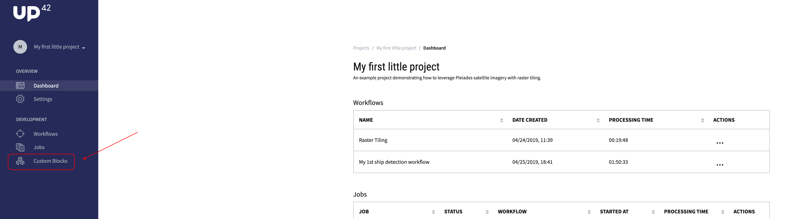

# Console FAQ

 Q: How can I change my password?

 A: 
 
 Q: I haven't received a verification code to validate my email
    address for my account how can I get this code to be resent?
 
 A: 

 Q: Where can I find the UUID associated with my UP42 user?
 
 A: The
 [UUID](https://en.wikipedia.org/wiki/Universally_unique_identifier)
 associated with your UP42 user can be found in the **custom blocks**
 menu item.
 
 
 
 
 Q: Can I change the email address associated with my UP42 account?
 
 A: Currently that is not possible. We will provide this feature in a
    upcoming release. 
 
 Q: Can I have multiple email addresses associated with my account?
 
 A: Not yet. That feature will come later in our product development.
