.. meta::
   :description: UP42 getting started: catalog search
   :keywords: rerun job howto, console, tutorial, catalog

.. _catalog_search:

====================
Catalog Search
====================

This section will guide you through searching for various geospatial data using the UP42 catalog. The data can further be integrated in your workflows and downloaded via job runs.

Create a workflow
-----------------

1. This process assumes that you already followed the steps 1-10 from the article `Build the first UP42 Workflow <https://docs.up42.com/getting-started/first-workflow.html>`_.
2. In the job configuration window, click on the catalog icon from the UP42 menu bar:

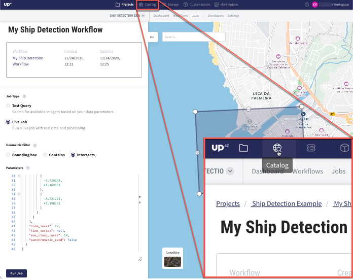

Open the UP42 catalog
---------------------

3. You will be redirected to the `UP42 catalog <https://console.up42.com/catalog>`_, where you can either upload your Area of Interest or draw a new AOI.

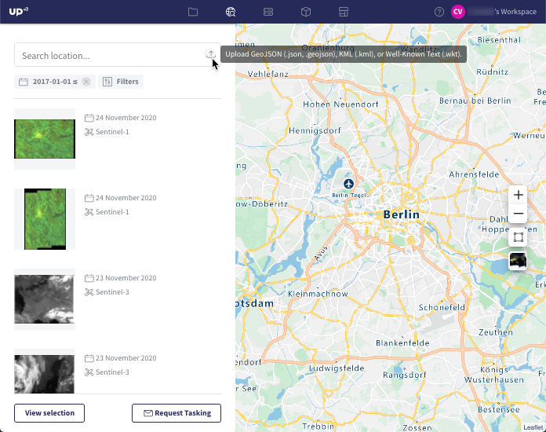

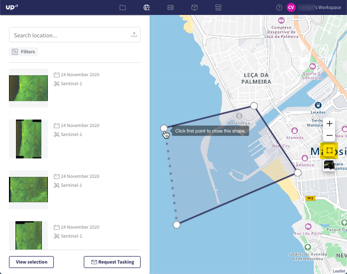

4. After uploading/drawing the AOI, you can adjust the following filters: *Date*, *Cloud Coverage* and *Data Source*.

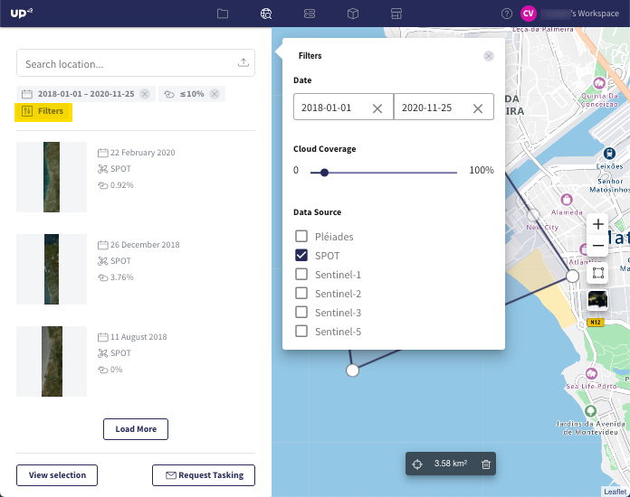

Select data
-----------

5. In the left dropdown list of images, select the image(s) that will be included in the workflow.

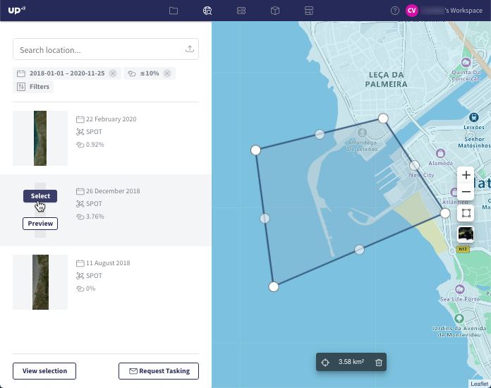

6. To double-check the visual quality of the selected image(s), click *Preview* and view the quicklooks (i.e. the low-resolution versions of the original images).

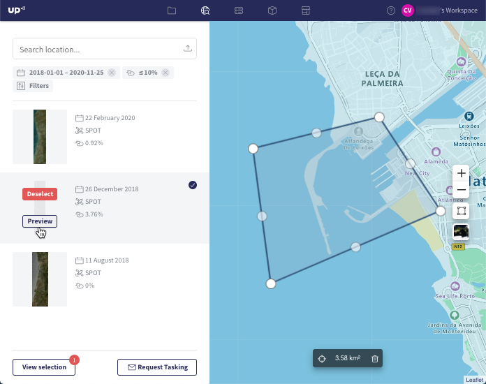

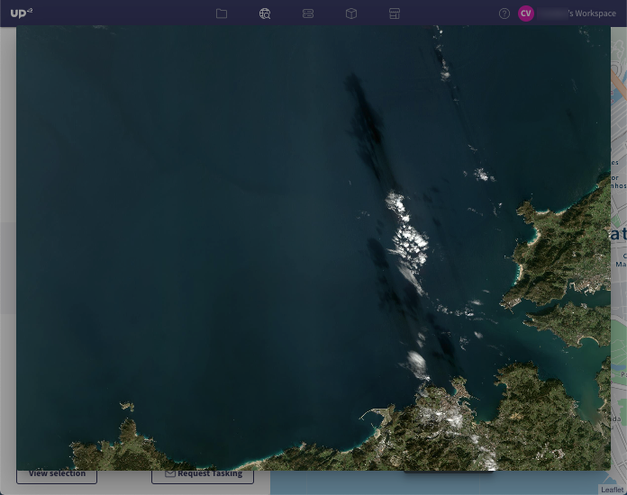

7. To proceed and use the selected image(s) in the workflow, click on *View selection*.

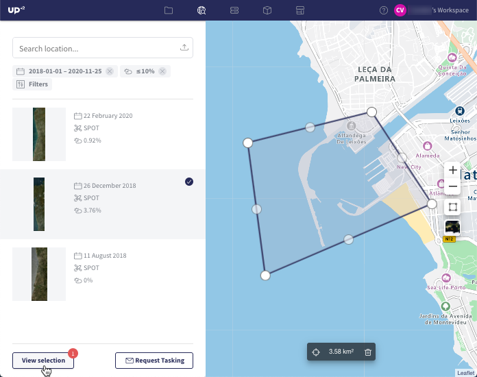

8. Before including the image(s) to the workflow, you can view the geometry and the image filenames in JSON format by clicking on *View Parameters*.

.. figure:: _assets/catalog/step07_view_parameters.png
   :align: center
   :alt: ViewParameters

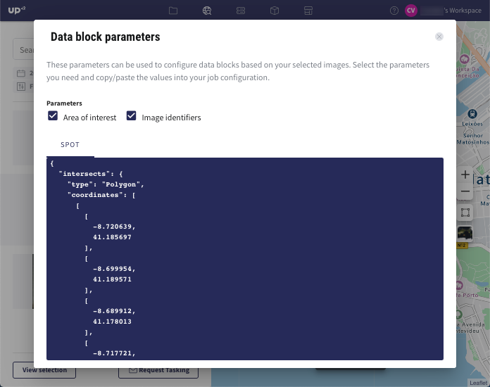

Run a job with the selected data
---------------------------------

9. Include the selected image(s) in your workflow by clicking on *Configure Job*.

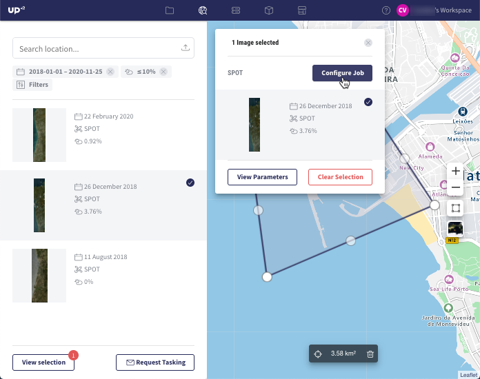

10. Your existing projects will be listed. Click on the desired project and a list of workflows will appear. Choose the workflow where you would like to include the image(s).

.. note::
   Please note that only the compatible workflows will be displayed. In this example, if your workflow includes a different data block from SPOT (Pleiades, Sentinel, Landsat etc.), it will not be displayed in the list, because it is not compatible with the SPOT images you selected in the catalog. Since we created a `workflow <https://docs.up42.com/getting-started/first-workflow.html>`_ based on a SPOT data block, it is displayed in the list.

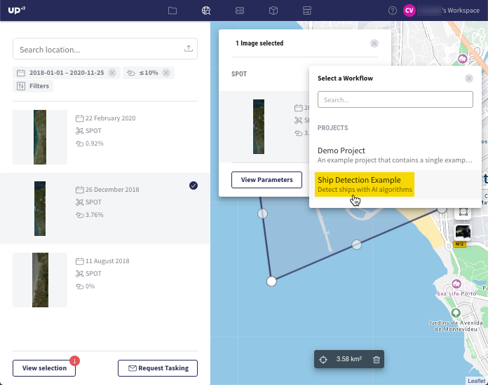

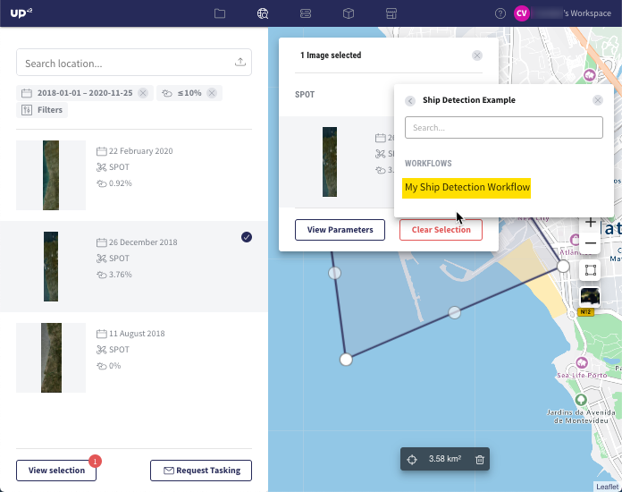

11. Click on the workflow and you will be redirected to the job configuration window. The image filename is now integrated in the job parameters. Run the job and download the outputs according to steps 12-19 from the article `Build the first UP42 Workflow <https://docs.up42.com/getting-started/first-workflow.html>`_.

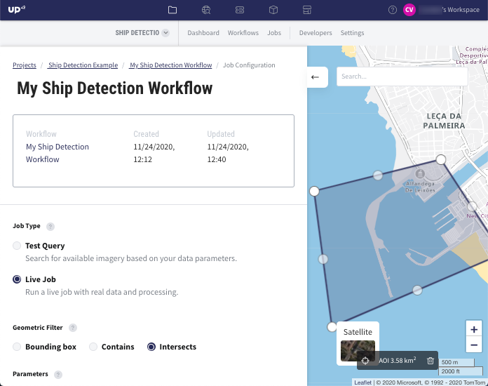

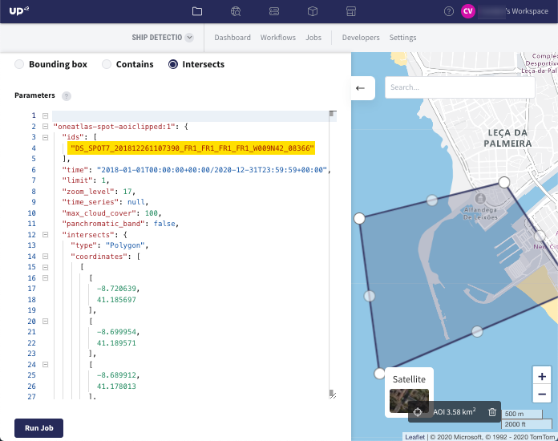

Congratulations! You successfully ran a job using the data selected from the UP42 catalog.
