.. meta::
   :description: UP42 getting started: catalog search
   :keywords: rerun job howto, console, tutorial, catalog

.. _catalog-search:

========
Catalog
========

Introduction
------------

This section will guide you through searching for various geospatial data using the **Catalog**. On the left sidebar, two tabs are displayed: **Data** and **Analytics**.

The **Data** tab returns only scenes available for ordering and includes images from all types of storage: long-term archive and online archive. The available data sources are displayed in the table below.

.. list-table::
   :widths: 25
   :header-rows: 1

   * - Data Source
   * - Pléiades
   * - SPOT 6/7

The **Analytics** tab returns images that can be used in workflows and downloaded or processed during job runs. This tab includes images from the online archive. The available data sources are displayed in the table below.

.. list-table::
   :widths: 25
   :header-rows: 1

   * - Data Source
   * - Pléiades
   * - SPOT 6/7
   * - Sentinel-1
   * - Sentinel-2
   * - Sentinel-5

.. note:: For Pléiades and SPOT 6/7 data sources, the ordering process via Data tab provides more scenes than Analytics tab,
          since it includes images from the long-term archive (LTA).

Long-term archive and online archive
------------------------------------

The differences between the long-term archive and online archive are described in the table below.

.. list-table::
   :widths: 25 25 50
   :header-rows: 1

   * - Tab
     - Archive type
     - Description
   * - Data
     - Long-term archive
     - the complete Pléiades and SPOT 6/7 image collection, regardless of incidence angle or cloud cover.
   * - Analytics
     - Online archive (Living Library)
     - a selection of Pléiades and SPOT 6/7 images that were acquired less than 2 years ago, have an incidence angle of maximum 30 degrees and up to 15% cloud cover (Pléiades) or up to 25% cloud cover (SPOT 6/7).

Data tab: order images
----------------------

The ordering process via the **Data** tab allows you to easily get Pléiades and SPOT 6/7 satellite images from both the long-term archive and online archive. The steps are described below.

1. Go to the `Catalog <https://console.up42.com/catalog>`_, where you can either upload your Area of Interest or draw a new AOI.

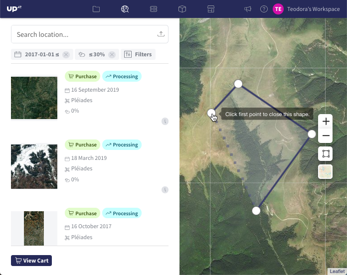

.. figure:: _assets/catalog/data/step01_Data_upload_AOI.png
   :align: center
   :alt: step01_Data_upload_AOI

2. After uploading/drawing the AOI, you can adjust the following filters: *Date*, *Cloud Coverage*, and *Data Source*.

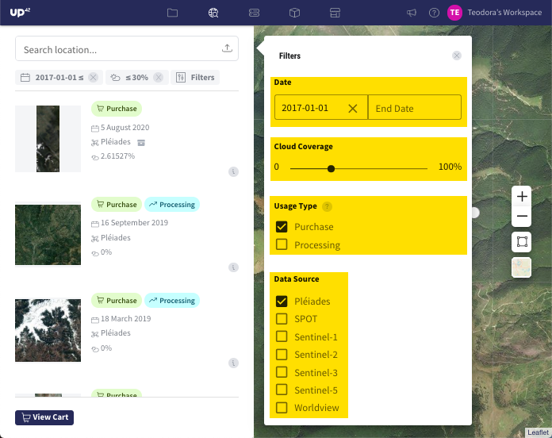

3. In the left sidebar, the list of available images is displayed and you can select the images you want to purchase.

.. tip:: In the Data tab, notice the |long-term-archive| icon displayed next to the available scenes. This
         icon  indicates that the scenes are stored in the long-term archive. The LTA includes more data than the online archive, but the duration for processing these orders takes longer time (up to 24 hours).

         .. |long-term-archive| image:: _assets/catalog/data/archive_icon.png

4. Click on *View Selection*, in order to visualize the preview of the selected image(s) and the estimated price of each image intersecting your AOI. Please note that only the segment of the image that intersects your AOI will be considered in the pricing, not the entire AOI.

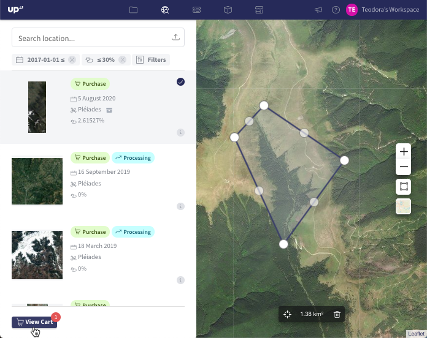

5. Click on *Preview*, in order to examine the overall visual quality of the image. Please note that previews offer a lower-resolution version of the original image.

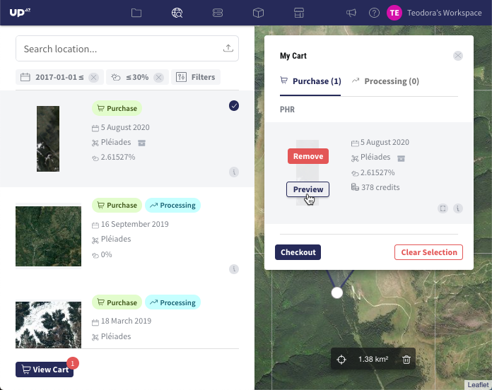

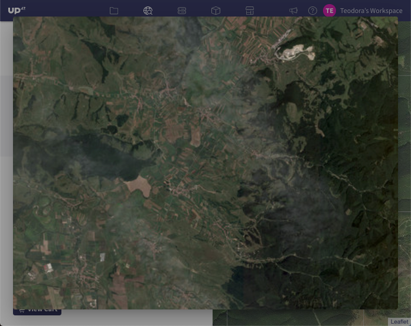

6. Click on *Checkout*, in order to view the order summary and the total estimated price. Please note that you are not charged at this step.

7. If you want to proceed with purchasing the images, click on *Confirm Purchase*. The order is officially placed and you are charged with the UP42 credits. The delivery of the images can take a few minutes (online archive) or up to 24 hours (long-term archive).

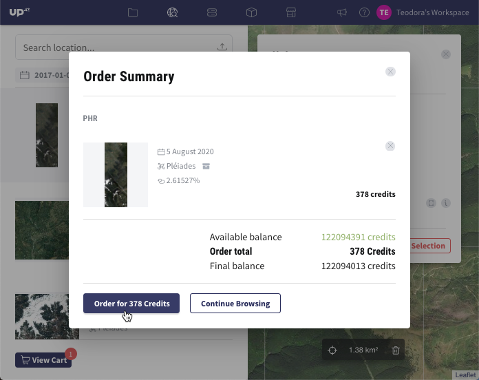

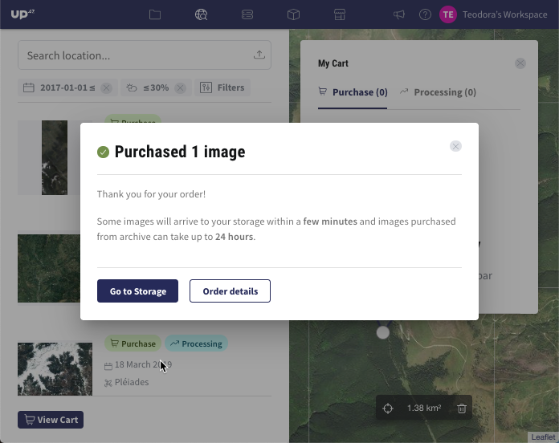

8. The status of an order is displayed in the `Storage <https://console.up42.com/storage/data?>`_. Open the tab *Orders* and the order will display the Status: *In Progress* or *Completed*. If the Status is *Completed*, open the tab *Data* and download the images from the column *Actions*.

Analytics tab: integrate images into workflows
----------------------------------------------

The **Analytics** tab returns data that can further be integrated into existing workflows and downloaded via job runs. The steps are described below.

1. This process assumes that you already built workflows by following the steps 1-10 from the article `Build the first UP42 Workflow <https://docs.up42.com/getting-started/first-workflow.html>`_.
2. In the job configuration window, click on the Catalog icon from the UP42 menu bar:

3. You will be redirected to the `Catalog <https://console.up42.com/catalog>`_, where you can either upload or draw an AOI.

.. figure:: _assets/catalog/analytics/step01_Analytics_draw_AOI.png
   :align: center
   :alt: step01_Analytics_draw_AOI

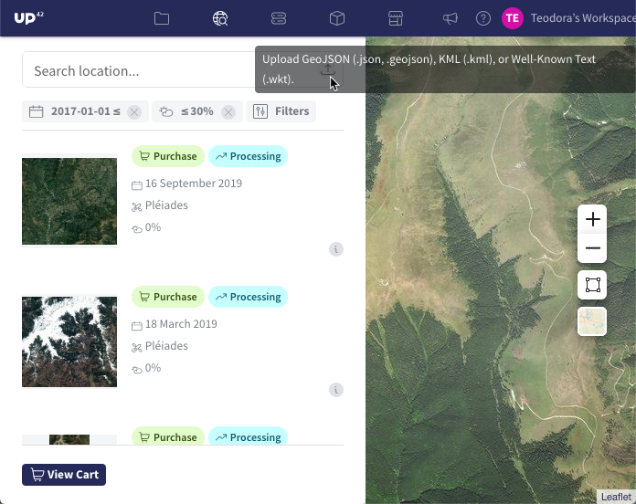

4. After uploading/drawing the AOI, you can adjust the following filters: *Date*, *Cloud Coverage* and *Data Source*.

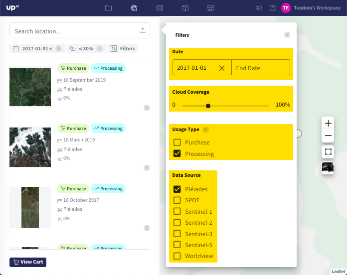

.. note:: The **Analytics** tab provides more Data Sources: **Pléiades**, **SPOT 6/7**, **Sentinel-1**, **Sentinel-2**, **Sentinel-3** and **Sentinel-5**.

5. In the left sidebar, the list of available images is displayed and you can select the image(s) to be included in the workflow.

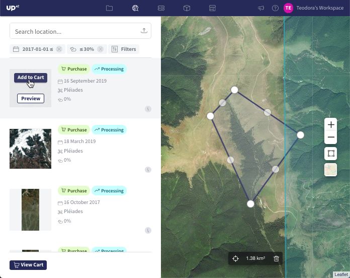

6. Click on *View Selection*, in order to visualize the preview of the selected image(s) and integrate them into a workflow.

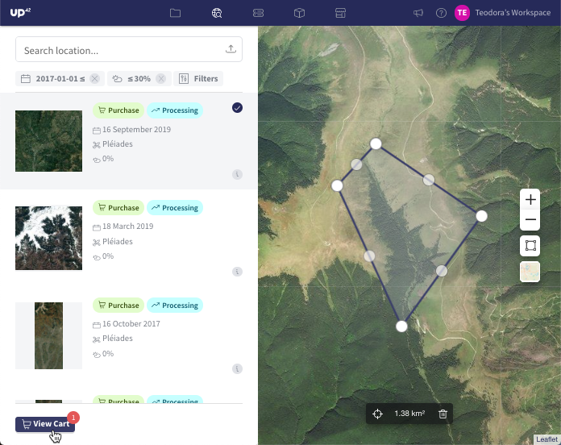

7. Click on *Preview*, in order to examine the overall visual quality of the image. Please note that previews offer a lower-resolution version of the original image.

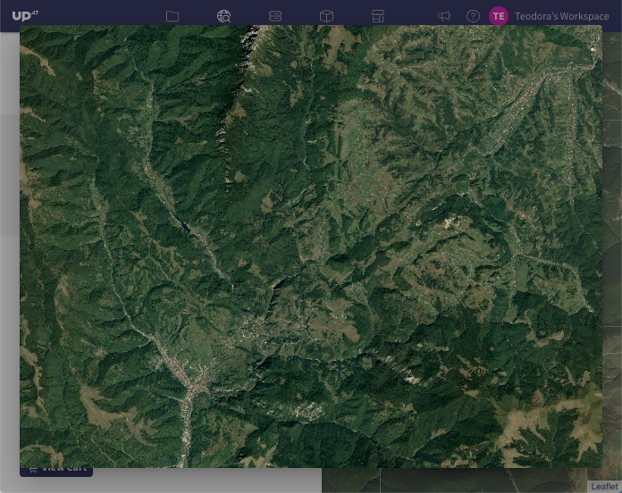

8. Before including the image(s) in the workflow, click on *View Parameters* to view the geometry and the image filenames in JSON format.

.. figure:: _assets/catalog/analytics/step07_Analytics_view_parameters.png
   :align: center
   :alt: step07_Analytics_view_parameters

9. Include the selected image(s) in your workflow by clicking on *Configure Job*.

.. figure:: _assets/catalog/analytics/step08_Analytics_configure_job.png
   :align: center
   :alt: step08_Analytics_configure_job

10. The image will only be included in existing workflows, which are stored in your projects. First, your existing projects will be listed. Click on the desired project and a list of workflows will appear. Choose the workflow where you would like to include the image(s).

.. figure:: _assets/catalog/analytics/step09_Analytics_select_project.png
   :align: center
   :alt: step09_Analytics_select_project

.. figure:: _assets/catalog/analytics/step10_Analytics_select_workflow.png
   :align: center
   :alt: step10_Analytics_select_workflow

.. note::
   Please note that only the compatible workflows will be displayed. In this example, if your workflow includes a different data block from Pléiades (SPOT 6/7, Sentinel-1, Sentinel-2 etc.), it will not be displayed in the list, because it is not compatible with the Pléiades images you selected in the Catalog. Since we already created a workflow *Normalized Difference Vegetation Index* based on a Pléiades data block, it is displayed in the list.

11. Once you click on the workflow, you will be redirected to the job configuration window. The image filename is now integrated in the job parameters under the variable ``ids``. The price will be estimated below the job parameters displayed in JSON format. Run the job and download the outputs according to steps 12-19 from the article `Build the first UP42 Workflow <https://docs.up42.com/getting-started/first-workflow.html>`_.

.. figure:: _assets/catalog/analytics/step11_Analytics_job_config_window.png
   :align: center
   :alt: step11_Analytics_job_config_window

Congratulations! You successfully ran a job using the data selected from the Catalog.
