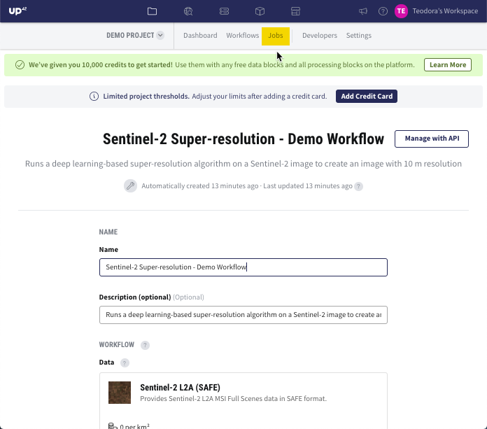

.. meta::
   :description: UP42 getting started: demo workflow
   :keywords: rerun job howto, console, tutorial, demo project

.. _first-job-run:

====================
Demo Workflow
====================

This section will guide you through viewing the results generated by a job run on the UP42 console. The job run is based on a demo workflow and computes a Normalized Difference Vegetation Index (:term:`NDVI`) map from a Pléiades satellite image.

The UP42 console
------------------------

To sign up to the `UP42 console <https://console.up42.com/>`_, please follow the steps from the article `Create an UP42 account <https://docs.up42.com/getting-started/sign-up.html>`_. 

After signing up and logging in the UP42 console, the dashboard displays the *Demo Project*. This project has been created in order for you to explore our platform and understand the concepts that UP42 is based on: :term:`workflows<workflow>`, :term:`data and processing blocks<block>`, :term:`jobs<job>` and :term:`tasks<task>`. For more information, please visit the article :ref:`Core concepts <core-concepts>`.

   The UP42 console

Explore the Demo Workflow
-------------------------------------

Click on the *Demo Project* and you will be redirected to the *Demo Workflow*. This workflow consists of the following blocks:

*   `Pléiades Reflectance (Download) <https://docs.up42.com/up42-blocks/data/pleiades-download.html>`_ data block
*   :ref:`Pan-sharpening SPOT/Pléiades <pansharpen-block>` processing block
*   `NDVI <https://docs.up42.com/up42-blocks/processing/ndvi.html>`_ processing block

.. figure:: _assets/demo/step02_workflow_structure.png
   :align: center
   :alt: StructureWorkflow

For the demo workflow, the following job parameters were used:

.. gist:: https://gist.github.com/up42-epicycles/35ac5a7fd87d0322abbb40f4cc84c671

View the outputs of the job run
-----------------------------------------

In order to generate the results of this workflow, a job needs to be run. In this example, the job has been run and the results are already generated. In UP42, the geospatial results are defined as *outputs*. Explore the outputs by going to the UP42 menu bar and click on *Jobs*.

The *Jobs* section displays the status of the job run as *Successful*, which indicates that the outputs are correctly generated. Click on *Successful* and you will be redirected to the page where the outputs can be downloaded.

You can download the outputs in more ways:

**1.  Last Output**. If you want to access the output from the last block, click on *Download*.

**2.  Intermediate Outputs**. If you want to access each individual output from each block, click on *Results*. In this case, you need to click on three *Results* buttons and get three different outputs.

The outputs from the demo workflow can be displayed in the free GIS software `QGIS <https://qgis.org/en/site/forusers/download.html>`_. In the GIS software, an NDVI map over an :term:`Area of Interest<AOI>` near Christchurch, New Zealand is displayed. For comparison purposes, both the original Pléiades image and the NDVI map are shown.

.. gist:: https://gist.github.com/up42-epicycles/b40d03163ad2dbe1bb43f09f084ef812

.. figure:: _assets/demo/step05_PHR_overview.png
   :align: center
   :alt: PHROverviewMap

.. figure:: _assets/demo/step06_PHR_image_closeup.png
   :align: center
   :alt: PHRCloseup

.. figure:: _assets/demo/step07_NDVI_map_closeup.png
   :align: center
   :alt: NDVICloseup

.. warning::
   Please be aware that the *Demo Project* and *Demo Workflow* (or any new workflows created in the *Demo Project*) have an AOI limit of 10 km :superscript:`2`. For larger AOI sizes of up to 100 km :superscript:`2`, you need to create a new project. If you add your credit card details in the UP42 account profile, these limitations are waived and you will be able to set the AOI size to maximum 1000 km :superscript:`2`.

.. tip::
   In this example, the Pléiades image was retrieved using an order ID defined by the parameter *order_ids* (see job parameters). This allows you to paste this order ID in any other job parameters and re-use the Pléiades image without limit!

Next steps
---------------

Congratulations! Your are ready to learn more about UP42 in the article `Build the first UP42 workflow <https://docs.up42.com/getting-started/first-workflow.html>`_.
