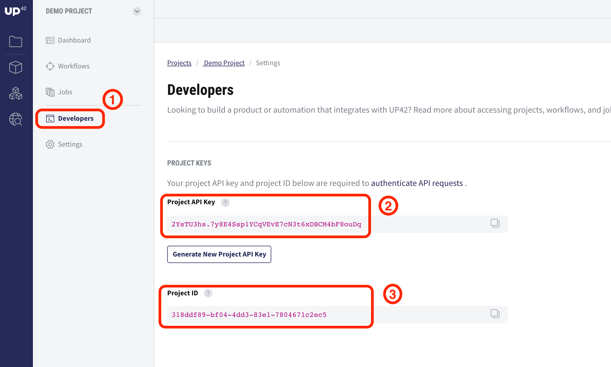
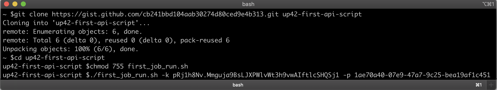
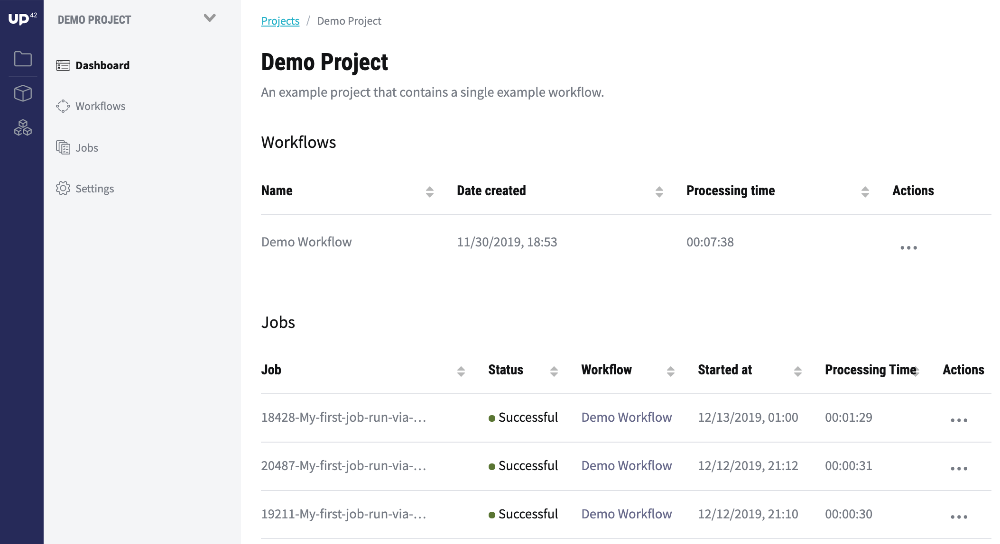

.. meta::
   :description: UP42 Getting started: Running your first job via the API
   :keywords: api, job run, howto, tutorial, demo project

.. _first-api-request:

=================
 Use the UP42 API
=================

This section helps you to get started with the UP42 API. We will run
the :term:`demo project` once more, but now using the API.

We will make use of a shell script written in Bash. This is just a
convenience. Our API is a `REST
<https://en.wikipedia.org/wiki/Representational_state_transfer>`_
API. It is therefore independent of any platform or specific software
constraints.

.. _api_requirements:

Requirements
------------

 + `Bash <https://en.wikipedia.org/wiki/Bash_(Unix_shell)>`__.
 + `cURL <https://curl.haxx.se>`__.
 + `jq <https://stedolan.github.io/jq/>`__.

.. _download-script:

Download the script
-------------------

To make this example as simple as possible, we will use a `provided
script
<https://gist.github.com/up42-epicycles/254ea9fb6fca467c54e284e48a2a7b68>`__
that handles the API commands.  Clone the script using git, go into
the script directory and make it executable:

.. code:: console

    git clone https://gist.github.com/cb241bbd104aab30274d80ced9e4b313.git up42-first-api-script
    cd up42-first-api-script
    chmod 755 first_job_run.sh

.. _run-script-api:

Run your first job via the API
------------------------------

In order to run a job via the API, you need to provide the
``project API key`` and ``project ID``. You can find both in the UP42
:term:`console`, in the **Developers** menu of the :term:`demo
project`.

.. _project-settings-api-data:

**project API key**

    The project-specific API key.
    Go to **UP42 Console > Demo Project
    > Developers** and copy the project API key which looks similar to
    this: ``pRj1h8Nv.Mmguja9BsLJXPWlvWt3h9vwAIftlcSHQSj1``.

**project ID**

    The unique identifier of the project.

    Go to **UP42 Console > Demo Project > Developers** and copy the project ID.
    The project ID also appears in the URL: ``https://console.up42.com/projects/<project
    ID>/developers``, where ``<project ID>`` looks similar to this:
    ``1ae70a40-07e9-47a7-9c25-bea19af1c451`` --- a random `UUID <https://en.wikipedia.org/wiki/Universally_unique_identifier#Version_4_(random)>`_.

Then run the script in the command line by providing the project API key & project ID as arguments:

.. code:: bash

   > ./first_job_run.sh -k <project API key> -p <project ID>

For example:

.. code:: bash

   > ./first_job_run.sh -k pRj1h8Nv.Mmguja9BsLJXPWlvWt3h9vwAIftlcSHQSj1 -p 1ae70a40-07e9-47a7-9c25-bea19af1c451

As a response, you will get information about the status of the job,
e.g. ``"Job <job ID> s RUNNING."``.  Here, ``<job ID>`` is a the
random identifier (following the `UUID
<https://en.wikipedia.org/wiki/Universally_unique_identifier#Version_4_(random)>`__
standard) for the job you just created. If you invoke the script
multiple times, each new job will get a unique ``job ID`` and a unique
``job name``.

The created jobs are displayed in the UP42 console in the :ref:`job overview <job-overview>` section.

If you try to launch a second job while a job is already running, you
will receive an error message corresponding to a `429
<https://httpstatuses.com/429>`_ HTTP status code:

.. code:: javascript

   {
     "error": {
       "code": "TOO_MANY_REQUESTS",
       "message": "Your project has too many non-finished jobs",
       "details": null
     },
     "data": null
   }

To further explore the API please go to the :ref:`API walktrough <api-walkthrough>`.
