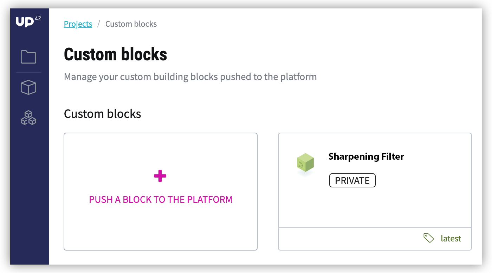

.. meta::
   :description: UP42 Getting started: pushing your first custom block
   :keywords: custom block, tutorial, howto, demo project 

.. _first-custom-block:
              
===============================
 Upload your first custom block
===============================

If you want to use your own processing methods or data sources on the UP42 platform,
you can create :term:`custom blocks<custom block>` that can be seamlessly integrated into UP42 :term:`workflows<workflow>`.
This section will guide you through bringing an example custom block to the UP42 platform.

We provide multiple example custom blocks (both data & processing) on our public `UP42 github profile <https://github.com/up42>`_.
In this chapter we will work with the `Sharpening filter example block <https://github.com/up42/sharpening>`_.
You can later use these public block examples as templates to easily write your own custom block code.

The block will appear in the `Custom blocks section <https://console.up42.com/custom-blocks/>`_ of your UP42 :term:`console` and can then be used
like any other processing block when building a workflow.

   The UP42 custom block console menu

.. _requirements:

Requirements
------------

This example requires the **Mac OS X or Linux bash**, an example using **Windows** will be provided shortly.
In order to bring this example block or your own custom block to the UP42 platform the following tools are required:

 - `UP42 <https://up42.com>`_ account -  Sign up for free!
 - `Python 3.7 <https://python.org/downloads>`_
 - `git <https://git-scm.com/>`_
 - `docker engine <https://docs.docker.com/engine/>`_
 - `GNU make <https://www.gnu.org/software/make/>`_

Instructions
------------

The following step-by-step instructions will guide you through setting up, dockerizing and pushing the example custom
block to UP42.

.. _clone_the_repository:

Clone the repository
++++++++++++++++++++

To access the example block code clone the repository using git in a bash terminal:

.. code:: bash

   git clone https://github.com/up42/sharpening.git

Then navigate to the folder via

.. code:: bash

    cd sharpening

Usually you would then proceed to customize the block code to fit your own needs, or install the necessary libraries to test the block code locally.
We will skip these steps here and directly push the block to the UP42 platform, see section :ref:`Developing a custom processing block <custom-processing-block-dev>`
for more advanced instructions on custom block development & publishing.

.. _build_the_block:

Build the custom block
++++++++++++++++++++++

First login to the UP42 docker registry. `me@example.com` needs to be replaced by your **UP42 username**,
which is the email address you use on the UP42 website.

.. code:: bash

   make login USER=me@example.com

In order to push the block to the UP42 platform, you need to build the block Docker container with your
**UP42 user ID**. To get your user ID, go to the `UP42 custom-blocks menu <https://console.up42.com/custom-blocks>`_.
Click on "`PUSH a BLOCK to THE PLATFORM`" and copy your user ID from the command shown on the last line at
"`Push the image to the UP42 Docker registry`". The user ID will look similar to this:
`63uayd50-z2h1-3461-38zq-1739481rjwia`

Pass the user ID to the build command:

.. code:: bash

   make build UID=<UID>

   # As an example: make build UID=63uayd50-z2h1-3461-38zq-1739481rjwia

.. _push_the_block:

Push the custom block to the UP42 platform
++++++++++++++++++++++++++++++++++++++++++

Now you can finally push the image to the UP42 docker registry, again passing in your user ID:

.. code:: bash

   make push UID=<UID>

   # As an example: make push UID=63uayd50-z2h1-3461-38zq-1739481rjwia

**Success!** The `Sharpening Filter` example block will now appear in the `UP42 custom-blocks menu <https://console.up42.com/custom-blocks>`_ menu
and can be selected under the *Custom blocks* tab when building a workflow.

You can find more advanced instructions on custom block development & publishing in the later section
:ref:`developing a custom processing block <custom-processing-block-dev>`.
