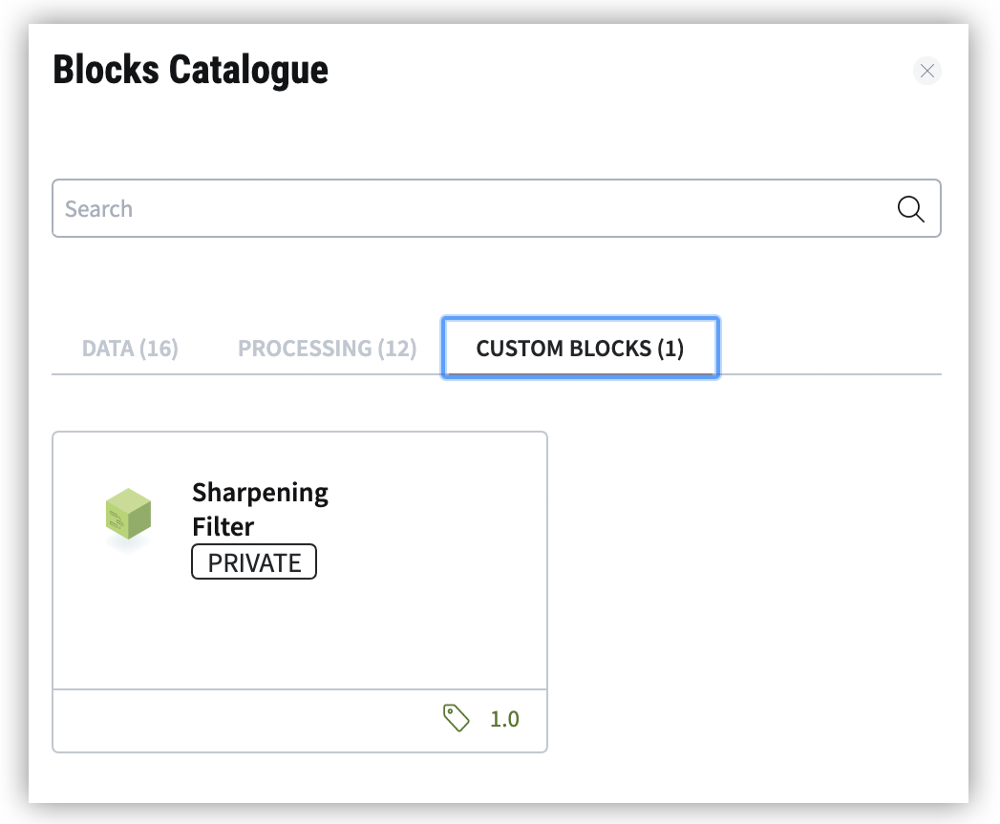

.. meta::
   :description: UP42 Getting started: pushing your first custom block
   :keywords: custom block, tutorial, howto, demo project 

.. _first-custom-block:

===============================
 Upload your first custom block
===============================

If you want to use your own processing methods or data sources on the UP42 platform,
you can create :term:`custom blocks<custom block>` that can be seamlessly integrated into UP42 workflows.
The block will appear in the `Custom blocks section <https://console.up42.com/custom-blocks/>`_ of
your UP42 :term:`console`. It can then be used like any other data or processing block.

This section will give you step-by-step instructions on how to upload a custom block to UP42, using
the `sharpening filter example block <https://github.com/up42/sharpening>`_ from our public `UP42 github profile <https://github.com/up42>`_.

.. figure:: _assets/custom_block_menu_sharpening.png
   :align: center
   :alt: The UP42 custom block console menu

.. _requirements:

Requirements
------------

This example requires the **Mac OS X or Linux bash**, `git <https://git-scm.com/>`_ and `Docker Engine <https://docs.docker.com/engine/>`_.
The example repository code uses `Python 3.7 <https://python.org/downloads>`_.

.. _clone_the_repository:

Download the example block
--------------------------

Clone the example block using git and navigate to the folder that contains the Dockerfile and UP42Manifest:

.. code:: bash

  git clone https://github.com/up42/sharpening.git
  cd sharpening/blocks/sharpening

We will skip changing the example code here and directly push the block to the UP42 platform.
See section :ref:`Developing a custom processing block <custom-processing-block-dev>` for more advanced instructions on custom block development.

.. _login_UP42_docker_repository:

Login UP42 Docker repository
----------------------------

First login to the UP42 docker registry. Replace **<USERNAME>** with the **email address** you login with on the UP42 website.
Make sure Docker is running on your computer. When asked for your password, enter your UP42 account password.

.. code:: bash

  docker login -u=<USERNAME> http://registry.up42.com

  # Example:
  docker login -u=hans.schmidt@up42.com http://registry.up42.com

.. _build_the_block:

Build the block container
-------------------------

Then build the block container, replace **<User-ID>** with your **UP42 User-ID**.

To get your **UP42 User-ID**, go to the the `UP42 custom-blocks menu <https://console.up42.com/custom-blocks>`_ and click on
"`PUSH A BLOCK TO THE PLATFORM`". At the bottom of the popup, copy your user ID from the
command "`Push the image to the UP42 Docker registry`" (e.g. ``6760d08e-54e3-4f1c-b22e-6ba605ec7592``).

.. code:: bash

  docker build . -t registry.up42.com/<USER-ID>/sharpening:1.0 --build-arg manifest="$(cat UP42Manifest.json)"

  # Example:
  docker build . -t registry.up42.com/6760d08e-54e3-4f1c-b22e-6ba605ec7592/sharpening:1.0 --build-arg manifest="$(cat UP42Manifest.json)"

.. _push_the_block:

Upload the custom block to UP42
-------------------------------

Now you can push the image to the UP42 docker registry. Replace **<User-ID>** with your **UP42 User-ID**.

.. code:: bash

   docker push registry.up42.com/<USER-ID>/sharpening:1.0

   # Example:
   docker push registry.up42.com/6760d08e-54e3-4f1c-b22e-6ba605ec7592/sharpening:1.0

**Success!** The Sharpening Filter example block will now appear in the `UP42 custom-blocks menu <https://console.up42.com/custom-blocks>`_.
When building a workflow it can be selected under the *Custom blocks* tab.

You can find more advanced instructions on custom block development & publishing in the chapter
:ref:`Developing a custom processing block <custom-processing-block-dev>`.
