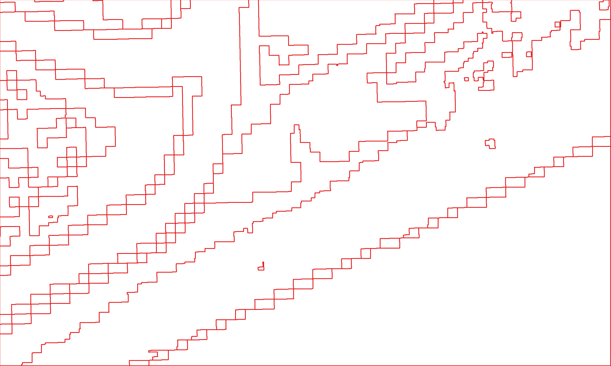
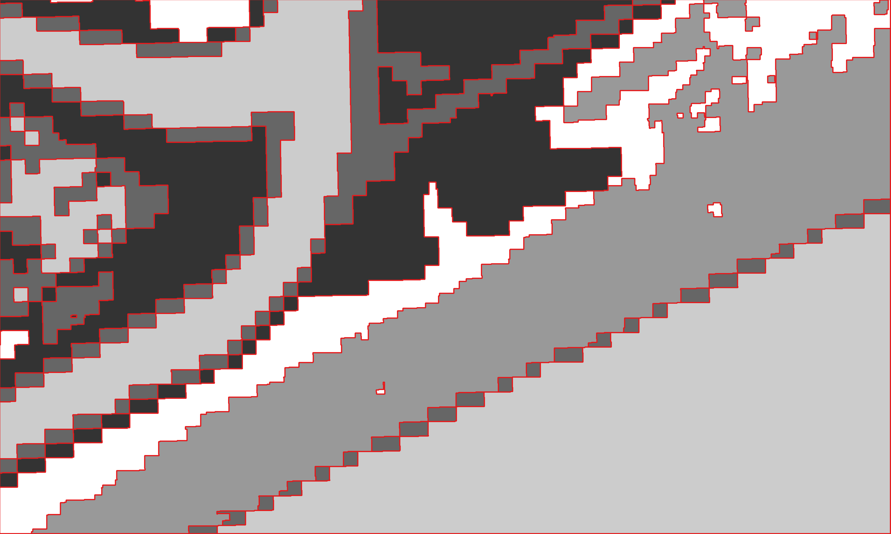

.. meta::
   :description: UP42 getting started: running your first job
   :keywords: rerun job howto, console, tutorial, demo project 

====================
 Run your first job
====================

This section guides through running your first :term:`job` using the
:term:`demo project`.  

Using the UP42 console for the first time
------------------------------------------

Once you log in you are on the UP42 :term:`console`. The console
allows you to do all manner of actions, from creating a
:term:`project`, adding a :term:`workflow` to it to running a
:term:`job`.

Demo project first job run
--------------------------

Once the demo project is created it comes with a :term:`workflow`
named ``Demo Workflow`` that is instantiated (run) in a
:term:`job`. This allows you to explore the :ref:`job results
<job-results>`.

Here is the :term:`AOI` used for this first automatically run job.

.. gist:: https://gist.github.com/perusio/26c0c134a9d9e9dd88e10e55bf04e903

The fetched imagery using the :ref:`Landsat 8
<sentinelhub-landsat8-aoiclipped-block>` data block. The effective
resolution is 15 meters, i.e., one pixel represents 15 meters on the
ground.

   Landsat 8 image for the given AOI.

   Land cover classification countour lines.

    
And the output of the demo :ref:`Land cover classification
<land_cover_demo_block>` overlayed on the data.

   Land cover classification overlayed with contour lines.

Rerun the demo project job as your first job
--------------------------------------------

The easiest option to run your first job is just to click on the
**Rerun Job** button that is at the top of the :ref:`Job overview
<job-overview>` page.

You will see the job instantiating the ``Demo Workflow`` going to
through the multiple statuses of a job from ``pending`` to
``succeeded`` [#]_. Now you just ran your first job. This means that
you are ready for the next step in exploring UP42: :ref:`Building your
first <build-first-workflow>`. 

.. rubric:: Footnotes

.. [#] In the :term:`console` a ``succeeded`` job status is displayed as ``Successful``.            
