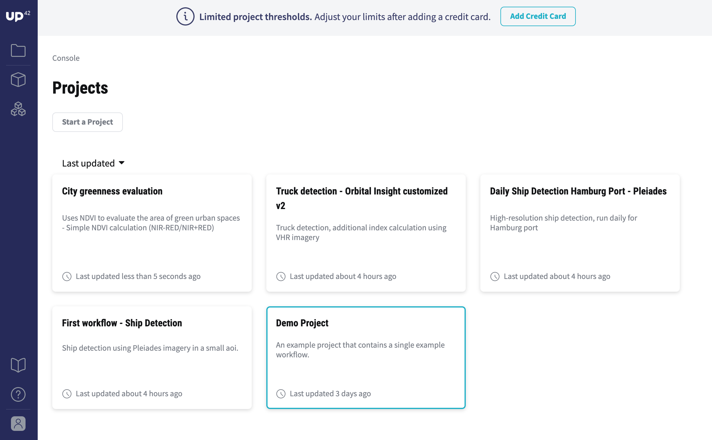
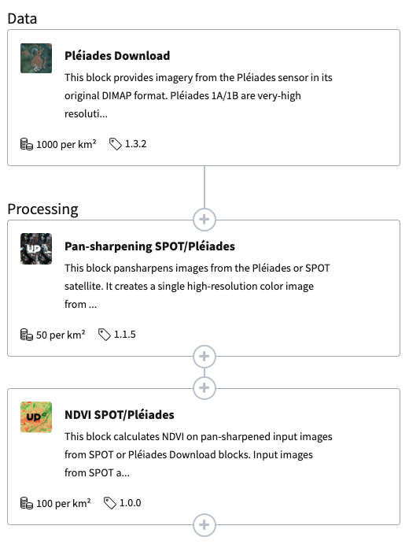
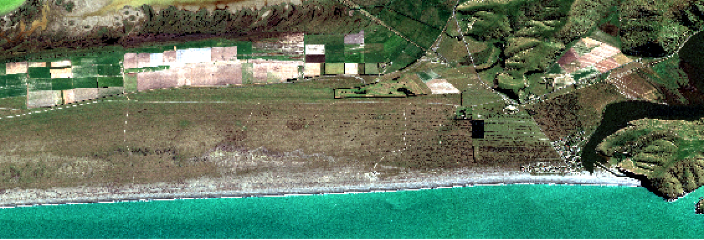
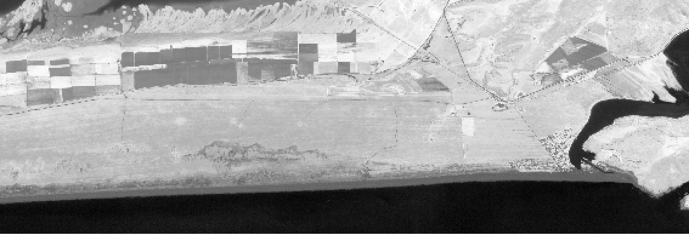

.. meta::
   :description: UP42 getting started: running your first job
   :keywords: rerun job howto, console, tutorial, demo project

.. _first-job-run:

====================
Run your first job
====================

This section will guide you through running your first job on the UP42
platform using a simple demo project that calculates an :term:`NDVI` Vegetation Index.

The UP42 console
-----------------

When you login to the UP42 website you get to the :term:`console`, the
central workspace of UP42. It allows you to create
:term:`projects<project>`, use data and processing
:term:`blocks<block>` to put together custom
:term:`workflows<workflow>` and run them as :term:`jobs<job>`.

   The UP42 console

Explore the Demo project
------------------------

We created a simple **Demo Project** for you to explore. The project
page contains the **Demo Workflow** made up of one :term:`data block`
for the Pléiades satellite imagery and two :term:`processing blocks <processing block>`
for the pansharpening and Normalized Difference Vegetation Index (NDVI). We
already ran the workflow for you, explore the results in the **Jobs** section.

This demo workflow takes a **satellite image** recorded by the :ref:`Pléiades
<pleiades-download-block>` sensor and clips it to an :term:`area of interest
(AOI)<AOI>` near Christchurch, New Zealand. Pléiades data has five bands, the
first four are Blue, Green, Red and Near-Infrared (NIR), at 2m resolution.
It also has a panchromatic band with 0.5m resolution that can be used to
:ref:`pansharpen <pansharpen-block>` the other four bands, bringing their resolution to
0.5m, as well. The third and final block of the workflow calculates the
NDVI, a very commonly used vegetation index which is an indicator of biomass
and vegetation health.

Above the pansharpened Pléiades image and below the resulting NDVI.

In the map below you can see where this image is located.

.. gist:: https://gist.github.com/up42-epicycles/b40d03163ad2dbe1bb43f09f084ef812

.. warning::

   Please be aware that the demo :term:`project` and :term:`workflow`,
   as well as all workflows created under the demo project have a
   limit of 10 km :superscript:`2` for AOI size. You need to create
   **another project** to be able to define AOIs up to 100 km
   :superscript:`2`. If you have a payment method defined in your
   account then these limitations **do not** apply. You will be able
   to set the AOI up to 1000 km :superscript:`2`.

          
Run your first job
-------------------

In order to run a job on your own, just click the ``Rerun Job`` button
at the top of the :ref:`Job overview<job-overview>` page. This will
instantiate the **Demo Workflow**, after a brief moment the status
will change from **pending** to **successful**.

Congratulations! Your are ready to learn more about UP42 in the
:ref:`Building your first workflow<build-first-workflow>` section!

A final note: the used :ref:`Pléiades DIMAP Download <pleiades-download-block>`
block is run using the ``order_ids`` parameter. This means you can re-use this
particular satellite image free of charge indefinitely! See the
:ref:`Download blocks tutorial<download-blocks-tutorial-spot-pleiades>` to
learn how that works.
