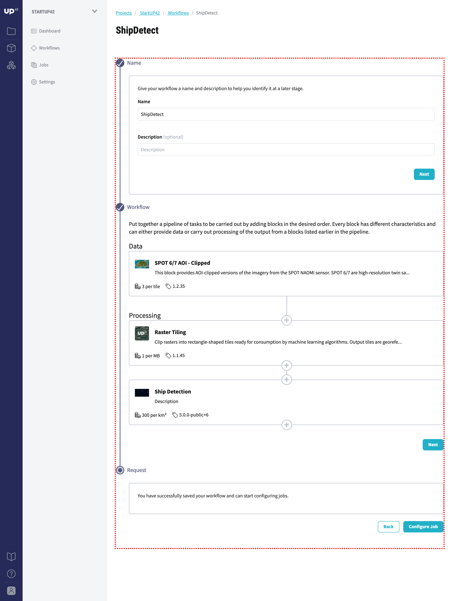

.. meta::
   :description: UP42 getting started: how to build a workflow
   :keywords: workflow how to, tutorial, data and processing blocks

.. _build-first-workflow:

Building your first workflow
============================

This guide will walk you through creating an workflow on the
platform, using blocks that already exist. The goal is to generate **ship detections**
in the harbour of Leixões, Portugal using SPOT data.

.. figure:: spot_image_overlayed_ships.png
   :align: center
   :alt: Overlayed ships and original SPOT image

   Matosinhos harbour, Portugal.

Creating a :term:`project` and :term:`workflow`
-----------------------------------------------

After logging in successfully, click on the **Start a Project** button to create your first :term:`project`
-- besides the demo project.

You will be asked to provide a project name and an optional
description. Once you saved the project, you will be taken to the
workflows overview for that project.

Use the **Create Workflow** button to get started. Once again you will
be asked to provide a name and an optional description, this time for
the :term:`workflow` that you are about to create. Enter a name and
click **Next**.

.. tip::
   Have a look at our :ref:`Core concepts <core-concepts>` page to find out more about Projects, Workflows and Jobs.

Adding blocks
-------------

A workflow consists of *Data blocks* and *Processing blocks*. A workflow always start with a data
block. Its output can then be used by a processing block, or a chain of processing blocks.

You should now see the workflow editor. Under the "Data" section,
click on **Add Block** and select the "SPOT 6/7 AOI - Clipped" block
to view it. Then click **Add Block** at the bottom of the modal
dialog. Your workflow will automatically be saved whenever you add or
remove a block.

.. tip::
   Click on top of the each *Data block* to find out more information about the
   data source like the provider name and the data format. All *Data block* is listed
   in our `Marketplace <https://up42.com/marketplace/>`_.

Next, under the "Processing" section, follow the same procedure, this
time selecting "Raster Tiling".

Add another processing block by clicking on the **+** sign under the
previously added Raster Tiling block. This time the  "Ship Detection" block.

   This is the workflow you have just created.

When you are done, scroll to the bottom of the workflow editor and
click **Next**.  You should now see a button labeled **Configure
Job** a the bottom of the workflow editor.

Click on it and you will be taken to the :term:`AOI` selector.

Configuring and running your :term:`job`
----------------------------------------

Select an AOI using the map widget, or by pasting a GeoJSON
``FeatureCollection`` into the text box to the left of the map. You
can also set the :ref:`date or date range <time-filter>` and
:ref:`limit <limit-filter>`, for instance, the maximum number
of images to return.

.. attention::
  By default the most recent image is returned. For a value of limit
  greater than 1, the images are returned by descending chronological order, that is,
  from most recent to least recent.

You can use the search box to look for a particular location of
interest to you. Then either choose to use a :ref:`Bounding box
<bbox-filter>`, :ref:`Intersects <intersects-filter>`
or :ref:`Contains <contains-filter>` filter. Click on the map and draw your AOI.

.. figure:: screenshot-aoi-selector.png
   :align: center
   :alt: Screenshot of your first workflow. Link: https://console.up42.com/projects/b45630bf-c6e1-4713-8f33-eeadaa536c44/workflows/a8f353a1-1bf4-43a3-a533-682355c3a3c2/configure-job

   This is the AOI selector.

.. gist:: https://gist.github.com/perusio/7dc5803b4fa8fb87d8ffa62909dc5fc4

.. tip::
   You can also generate a ``FeatureCollection`` with `geojson.io <http://geojson.io/>`_.

Here are the :term:`job parameters` used in this example:

.. gist:: https://gist.github.com/perusio/f8d8f3fe8ebb590cb3d8a5810c7a6060

Once you selected the AOI click on **Run Job** to
launch the ship detection workflow.

You will then be taken to the jobs overview for the current project.

.. _job-overview:

Job overview
------------

Here you can see the job status and metadata about the job,
as well perform multiple actions on the job.

 + **Rerun Job**: to re-run a job that is running or has finished.
 + **Cancel Job**: to cancel a job that is running.
 + **Job Progress**: clicking on it displays a log of the running job.
 + **Parameters**: displays the job parameters, including, selected
   AOI and other block specific parameter values being used on the job.

Each step of the workflow is a single block, running with the
parameters and data of the workflow.

There is a table in which each row correspond to a block in the
created workflow - this is a :term:`task`. Clicking on the **name** of a block takes you to a
specific task overview page, showing the logs for that task.

Once a job has finished a new column (**Actions**) becomes visible and
by hovering the **...** the **Run again** button appears. Clicking on
it relaunches that step of your job, that is, it reruns that particular
block.

.. _job-results:

Job results
-----------

Once the job has completed, you can download the result data by
clicking on the **Download** link at the top of the page. You can also
get a preview of the resulting GeoJSON file by clicking **Preview** at
the top.

A low resolution preview is given as :term:`quicklooks` - you
can view it by clicking on the **Quick Looks** button at the top.

Here are the results of our ship detection, first for each task of the workflow and
then the final result.

Input data
~~~~~~~~~~
.. figure:: spot_original_image.png
   :align: center
   :alt: SPOT image from Matosinhos port Portugal

   SPOT image: generated by SPOT 6/7 block.

Tiling result
~~~~~~~~~~~~~
.. figure:: spot_tiling.png
   :align: center
   :alt: Tiled Matosinhos port image

   Tiled image: generated by raster tiling block.

Detected ships
~~~~~~~~~~~~~~
.. figure:: spot_detected_ships.png
   :align: center
   :alt: Mask with found ships in Matosinhos port

   Mask showing found ships.

Detected ships with input data
~~~~~~~~~~~~~~~~~~~~~~~~~~~~~~
.. figure:: spot_image_overlayed_ships.png
   :align: center
   :alt: Overlayed ships and original SPOT image

   Detected ships overlaid with image.

And finally the detected ships overlaid with the base map.

.. gist:: https://gist.github.com/perusio/6f666485dadab8fec62879ef9a4f3291

.. tip::
   You can add the resulting GeoJSON into QGIS <https://qgis.org/en/site/>`_
   for further inspection.
