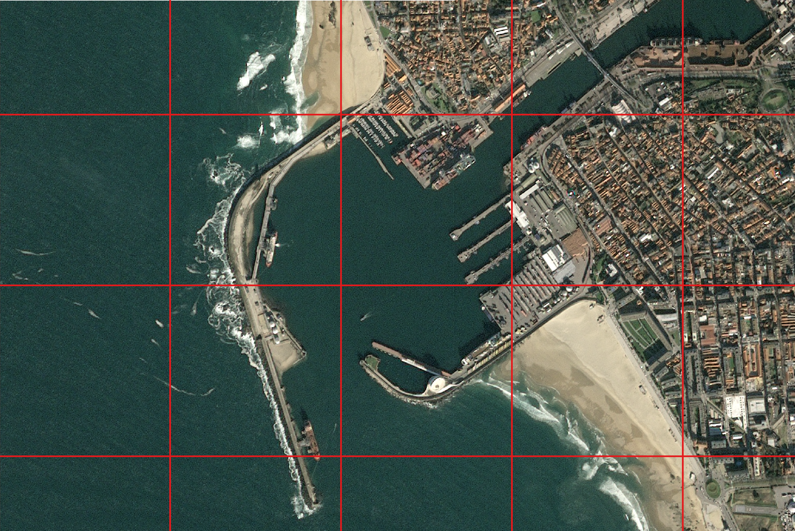
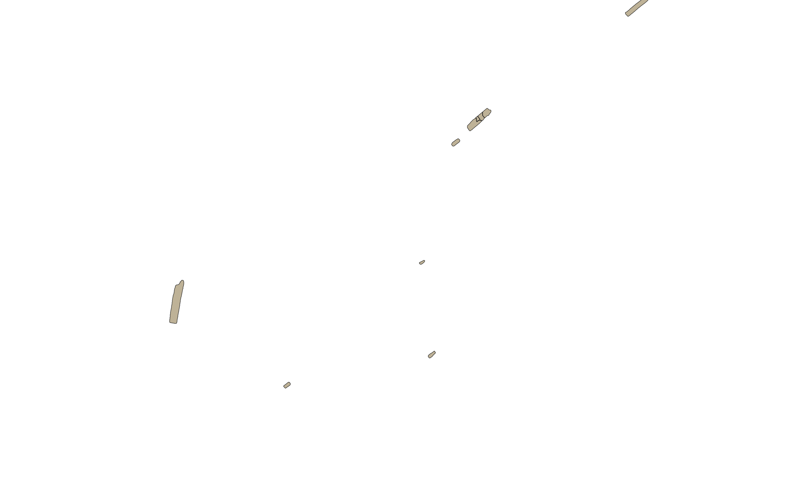
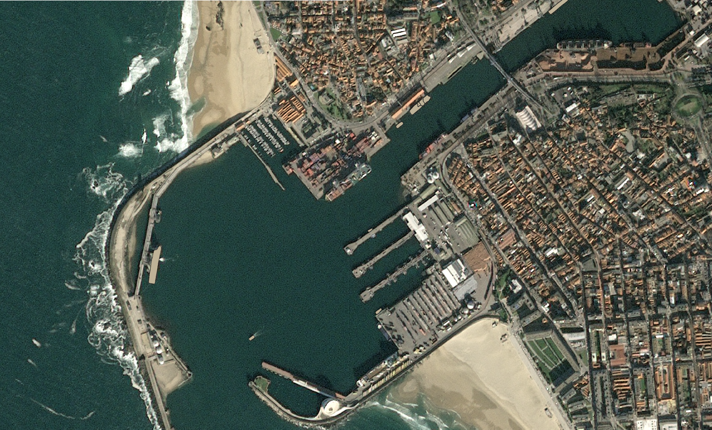

.. meta::
   :description: UP42 getting started: how to build a workflow
   :keywords: workflow howto, tutorial, data and processing blocks 

.. _build-first-workflow:
              
Building your first workflow
============================

This guide will walk you through creating an initial workflow on the
platform, using blocks that already exist.

Creating a project and workflow
-------------------------------

After logging in successfully, you will find yourself on the welcome page.

Click on the **Start a Project** button to create your first :term:`project`
-- besides the demo project.

You will be asked to provide a project name and an optional
description. Once you saved the project, you will be taken to the
workflows overview for that project.

Use the **Create Workflow** button to get started. Once again you will
be asked to provide a name and an optional description, this time for
the :term:`workflow` that you are about to create. Enter a name and
click **Next**.

Adding blocks
-------------

A workflow consists of *Data blocks* and *Processing blocks*. A workflow always start with a data
block. Its output can then be used by a processing block, or a chain of processing blocks.

You should now see the workflow editor. Under the "Data" section,
click on **Add Block** and select the "SPOT 6/7 AOI - Clipped" block
to view it. Then click **Add Block** at the bottom of the modal
dialog. Your workflow will automatically be saved whenever you add or
remove a block.

Next, under the "Processing" section, follow the same procedure, this
time selecting "Raster Tiling".

Add another processing block by clicking on the **+** sign under the
previously added Raster Tiling block. This time the  "Ship Detection" block.

When you are done, scroll to the bottom of the workflow editor and
click **Next**.  You should now see a button labeled **Configure
Job** a the bottom of the workflow editor.

Click on it and you will be taken to the :term:`AOI` selector.

Configuring and running your :term:`job`
----------------------------------------

Select an AOI using the map widget, or by pasting a GeoJSON
``FeatureCollection`` into the text box to the left of the map. You
can also set the date, date range and limit, i.e., the maximum number
of images to returned. By default the most recent image is
returned. For a value of limit greater than 1, the images are returned
by descending chronological order. From most recent to least recent.

You can use the search box to lock for a particular location of
interest to you. Then either choose to use a **Bounding box** or a
**Intersects** or **Contains**. Click on the map and draw your AOI.

.. gist:: https://gist.github.com/perusio/f8d8f3fe8ebb590cb3d8a5810c7a6060

Once you are content with the selected AOI click on **Run Job** to
launch the job consisting of the created workflow.

You will then be taken to the jobs overview for the current project.

.. _job-overview:

Job overview
------------

Here you can see the job status and metadata about the job,
as well perform multiple actions on the job.

 + **Rerun Job**: to re-run a job that is running or has finished.
 + **Cancel Job**: to cancel a job that is running.
 + **JOB PROGRESS**: clicking on it displays a log of the running job.
 + **PARAMETERS**: displays the job parameters, including, selected
   AOI and other block specific parameter values being used on the job. 

Each step of the workflow is a single block, running with the
parameters and data of the workflow.
   
There is a table in which each row correspond to a block in the
created workflow. Clicking on the **NAME** of the block takes to a
specific block job overview page, showing the logs for that block
when running the job.

Once a job has finished a new column **ACTIONS** becomes visible and
by hovering the **...** the **Run again** button appears. clicking on
it relaunches that step of your job, i.e., it reruns that particular
block.

.. _job-results:

Job results
-----------

Once the job has completed, you can download the result data by
clicking on the **Download** link at the top of the page. You can also
get a preview of the resulting GeoJSON file by clicking **Preview** at
the top. A low resolution preview is given: :term:`quicklooks`. You
can view it by clicking on the **Quick looks** button at the top.

Here are the results, first for each step (task) of the workflow and
then the final result.

.. figure:: spot_original_image.png
   :align: center
   :alt: SPOT image from Matosinhos port Portugal        

   SPOT image: generated by SPOT 6/7 block.  

   

   Tiled image: generated by raster tiling block.

    

   Mask showing found ships.

         
   Detected ships overlayed with image.

And finally the detected ships overlayed with the base map.
   
.. gist:: https://gist.github.com/perusio/6f666485dadab8fec62879ef9a4f3291
