.. meta::
   :description: UP42 getting started: how to build a workflow
   :keywords: workflow how to, tutorial, data and processing blocks

.. _build-first-workflow:

Build the first UP42 workflow
=============================

This guide will walk you through creating a project and running a workflow from scratch. The goal is to automatically detect ships in the harbour of Leixões (Portugal) using SPOT satellite images.

.. tip::

   For more detailed explanations, please check out the :ref:`UP42 video tutorials <video-tutorials>`.

.. figure:: _assets/spot_image_overlayed_ships.png
   :align: center
   :alt: Overlayed ships and original SPOT image

   Ship detection in Leixões, Portugal.

.. gist:: https://gist.github.com/up42-epicycles/f6b72e3b98b2ca890e3e79e246e8e731

Create a project and a workflow
-----------------------------------------------

1. In order to access the UP42 console, you first need to sign up by following the steps from the article `Create an UP42 account <https://docs.up42.com/getting-started/sign-up.html>`_. After signing up, create your first :term:`project` by clicking on *Start a Project*.

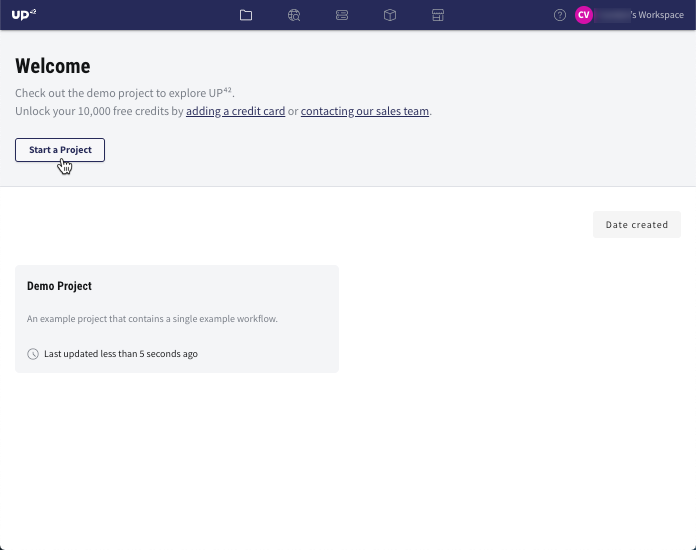

2. Provide a name to your project and add a description (if applicable). Click on *Save*.

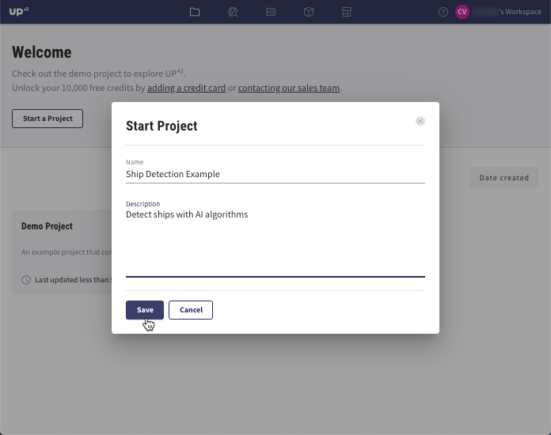

3. In order to take advantage of the UP42 geospatial data and algorithms, you need to build a :term:`workflow` by clicking *Create Workflow*.

.. tip::
   For more information about projects, workflows and jobs, please check the page :ref:`Core concepts <core-concepts>`.

Add blocks
-------------------

4. In the UP42 platform, a workflow consists of *data blocks* and *processing blocks*. The first block is always a data block. This data block can be followed by one or more processing blocks. In this example, a workflow based on the detection of ships from high-resolution SPOT images (1.5 m spatial resolution) will be shown. The first step is to select the data block from which ships will be extracted. Click on *Add data*.

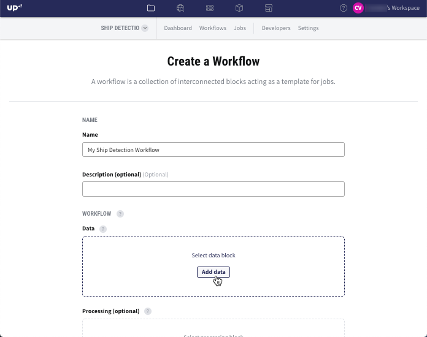

5. Browse for the data block *SPOT 6/7 Display (Streaming)*. This data block consumes 3 UP42 credits per tile, which is the equivalent of 0.03 Euro/Dollars. Click on this block and read its description, where additional details are provided. Click on *Add Block*.

6. The next block that follows the data block is a processing block. Click on *Add processing*.

7. Browse for the processing block *Raster Tiling*. This block consumes 0 UP42 credits per megabyte (MB). Click this block and read its description, where additional details are provided. Click on *Add Block*.

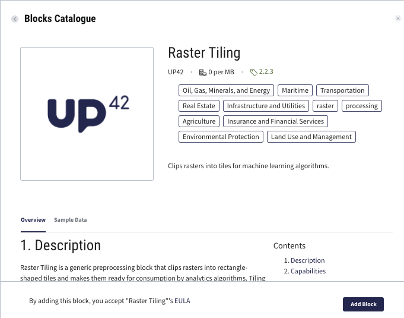

8. The final block that follows this processing block is another processing block. Click the plus sign after the previously added processing block.

9. Browse for the processing block *Ship Detection*. This block consumes 300 UP42 credits per square kilometers, which is the equivalent of 3 Euro/Dollars. Click this block and read its description, where additional details are provided. Click on *Add Block*.

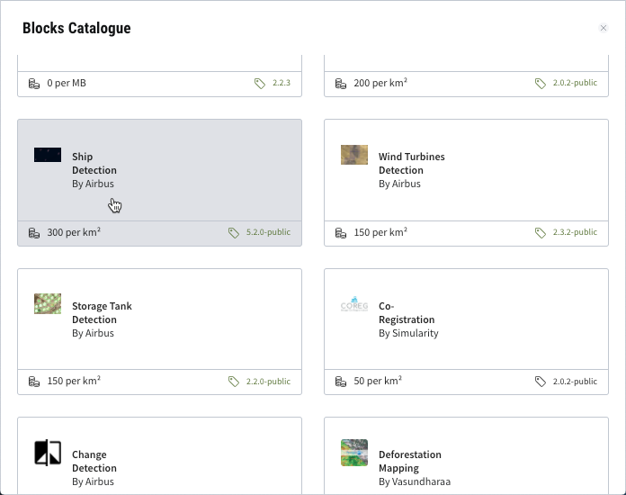

.. tip::
   All the data and processing blocks are listed in our `UP42 Marketplace <https://up42.com/marketplace/>`_.

Congratulations, you successfully created an UP42 workflow!

Configure job
-------------------

10. Now that the workflow is created, it needs to be run as a :term:`job`. To continue, click on *Save & Configure Job*.

11. You will be redirected to the job configuration window. In this window, you can draw the *Area of Interest* (AOI), select the *Geometric Filter* (:ref:`bounding box <bbox-filter>`, :ref:`intersects <intersects-filter>` or :ref:`contains <contains-filter>`) and adjust the parameters in JavaScript Object Notation (JSON) format. On the left side, you can adjust various parameters, such as the :ref:`time <time-filter>` or the :ref:`limit <limit-filter>`. On the lower left side, the price estimation is displayed (for more information, proceed to step 12).

.. note:: The coordinates of the AOI can also be copied and pasted from other sources as a GeoJSON *geometry*. We recommend using the online GIS tool `GeoJSON.io <http://geojson.io/>`__ (see screenshot below).

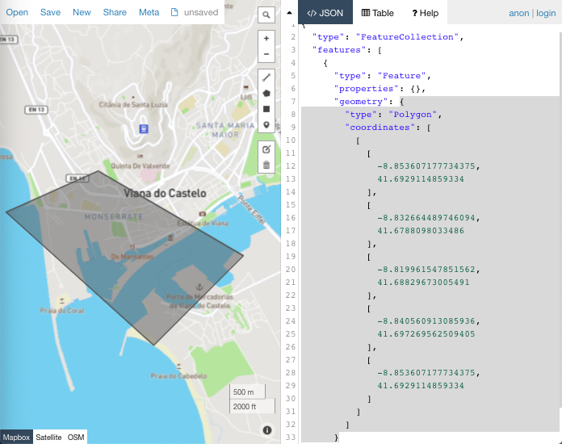

In this example, the following :term:`job parameters` were used:

.. gist:: https://gist.github.com/up42-epicycles/6dd5969c67ae16e5e5153e475f63c1ae

.. attention::
  If the *limit* is set to 1, the most recent image is returned by default. For a limit value greater than 1, the images are returned by descending chronological order (i.e. from most recent to least recent).
  
Price estimation
----------------------

12. Depending on the size of the AOI and the parameters you previously adjusted, the total price is estimated in the lower left side of the job configuration window. It is recommended to scroll down, in order to view the total estimated price.

.. note:: In this example, the UP42 credits which will be consumed range between 4103 and 5359 (the equivalent of approximately 50 euro). If your UP42 credit balance is not sufficient, you can reduce the size of the AOI or tweak the job parameters. The price estimation will change in real time.

Run job
-----------

13. After drawing the AOI and configuring the parameters, you can run the job in two ways:

*  check image availability by first running a *Test Query* and then running a *Live Job* (also defined as *Real Job*)
*  run a *Live Job*

**13.1  Test Query**

If you first run a *Test Query*, this will query for available images for your selected area and parameters, which will not consume credits. Only the quicklooks and metadata of the available images are generated. To access this information, follow the steps below:

* In order to view the quicklooks and have a general idea of the cloud cover and image availability, click on *Quick Looks*. Please note that quicklooks are a low-resolution version of the original images. If you have more quicklooks, you can scroll from left to right and view each quicklook individually.

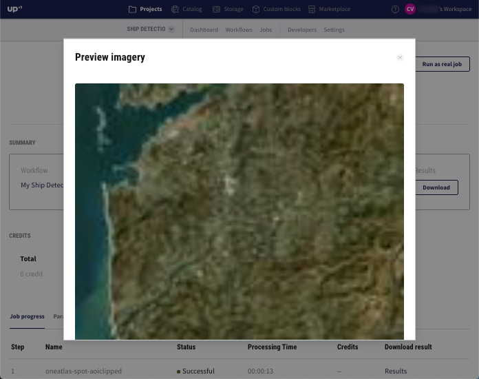

* In order to view the metadata and have a general idea of the acquisition date, snow cover, sensor type etc., click on *Preview*.

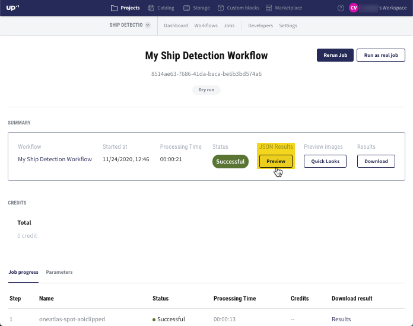

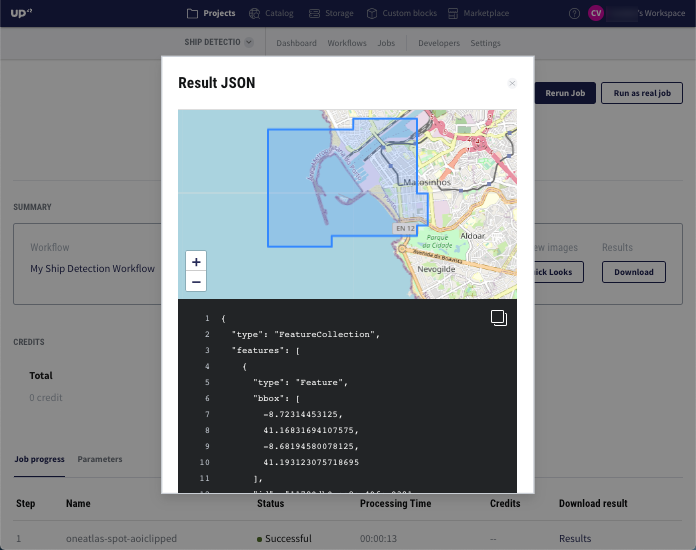

**13.2  Live Job**

If you are satisfied with the quicklooks and metadata, you can run a *Live Job* by clicking on *Run as real job*. For more information, proceed to step 13.

.. warning:: A *LiveJob* consumes credits. We recommend first running a *Test Query* and making sure the job parameters
                  are correctly set.

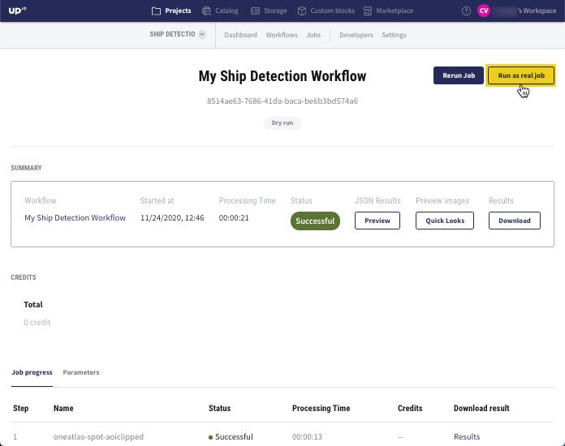

14. If you wish to skip the *Test Query* and proceed with directly generating the geospatial outputs, launch a *Live Job* (also defined as *Real Job*). This will consume credits and generate the following outputs: 

*  the SPOT satellite image(s) from the `SPOT 6/7 Display (Streaming) <https://docs.up42.com/up42-blocks/data/spot-display-streaming.html>`_ data block. Streamed images are only used as a basis for applying algorithms and cannot be downloaded. For downloading SPOT images, please use the data blocks `SPOT 6/7 Display (Download) <https://docs.up42.com/up42-blocks/data/spot-display-download.html>`_ or `SPOT 6/7 Reflectance (Download) <https://docs.up42.com/up42-blocks/data/spot-reflectance-download.html>`_
*  the SPOT image tiles from the `Raster Tiling <https://docs.up42.com/up42-blocks/processing/tiling.html>`_ processing block
*  the ships from the `Ship Detection <https://marketplace.up42.com/block/79e3e48c-d65f-4528-a6d4-e8d20fecc93c>`_ processing block

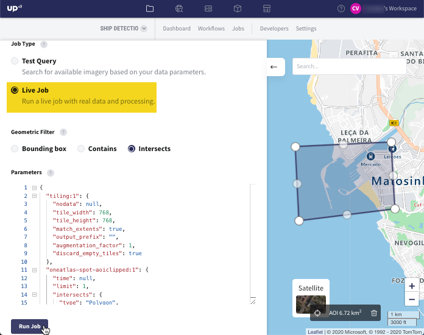

15. The job status is displayed in grey as *Running*.

.. figure:: _assets/step24_jobPending.png
   :align: center
   :alt: PendingJob

.. note:: The *Jobs* window displays the job status and metadata, as well as multiple actions to perform:

             *  **Rerun Job**: Repeats a job that is running or has finished.
             *  **Cancel Job**: Cancels a job that is running.
             *  **Job progress**: Displays a log of the running job and the status for each steps.
             *  **Parameters**: Displays the job parameters in JSON format.
             
             In the *Job progress*, each step name corresponds to a block in the workflow and it is defined as a :term:`task`.
             Clicking on each of these names will display the task overview page and the logs for that task.

16. When the job run is finalized, the status is displayed in green as *Successful*:

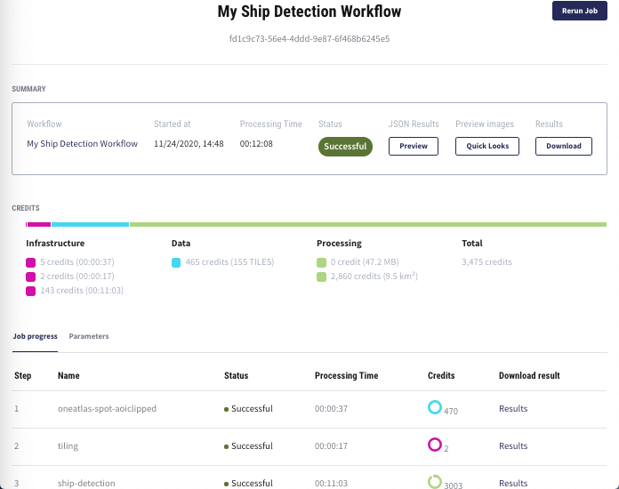

.. _job-results:

Download job results
----------------------------

17. Once the job run is finished, you can download the outputs in more ways:

**17.1.  Last Output**

If you want to access the output from the last block, click on *Download*.

**17.2.  Intermediate Outputs**

If you want to access each individual output from each block, click on *Results*.

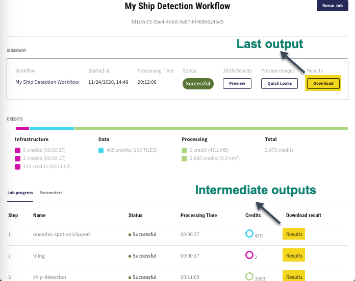

18. The outputs will be downloaded by default in the folder *Downloads* as TAR archives. The TAR archives need to be unzipped. For Windows OS, it is recommended to unpack them with third-party tools. For more information, please read this article: `How to unpack a tar file in Windows <https://wiki.haskell.org/How_to_unpack_a_tar_file_in_Windows>`_.

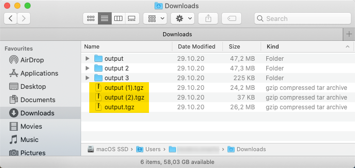
   
19. Once the TAR archives are unpacked, you will have a collection of results stored in folders named *output*. After opening the contents of these folders, various files will be displayed. Please note that the outputs are available in either raster or vector file formats.

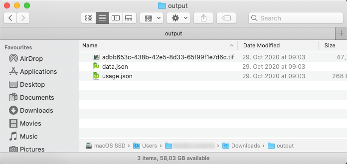

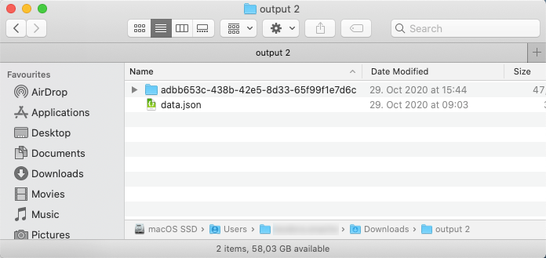
   

   
Visualize job results
----------------------------
   
20. UP42 does not support the visualization of these geospatial results. It is recommended to download the free GIS software `QGIS <https://qgis.org/en/site/forusers/download.html>`_, where you can display and further analyze the results. For this example, the results are displayed in the sections below.

Tiled SPOT image
~~~~~~~~~~~~~~~~
.. figure:: _assets/spot_tiling.png
   :align: center
   :alt: Tiled SPOT satellite image

Detected ships
~~~~~~~~~~~~~~
.. gist:: https://gist.github.com/up42-epicycles/b4e7d05ed53748c77b557f23f2c12702

Detected ships overlayed on the SPOT image
~~~~~~~~~~~~~~~~~~~~~~~~~~~~~~~~~~~~~~~~~~~

.. figure:: _assets/spot_image_overlayed_ships.png
   :align: center
   :alt: Overlayed ships and original SPOT satellite image
