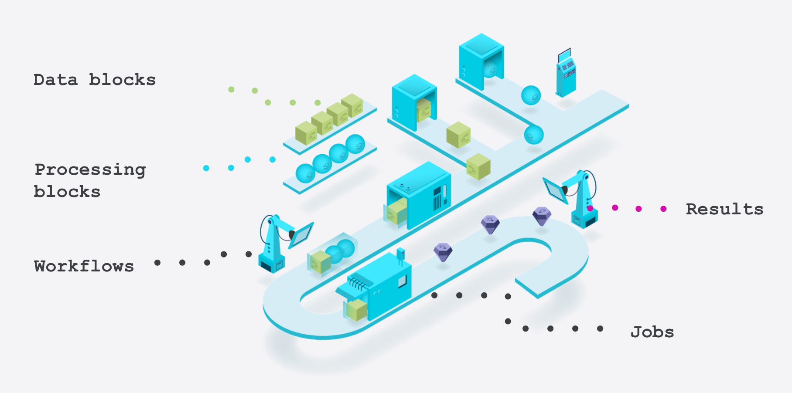

.. meta::
   :description: UP42 getting started documentation: index page
   :keywords: tutorial, howto, console, UP42

.. _getting-started:

Getting started with UP42
=========================

UP42 aims to democratize the access to free and commercial satellite data and advanced algorithms that extract valuable information for numerous use cases: flood mapping, vegetation health monitoring, object detection, land cover change and many more. UP42 also provides tools which facilitate integrating a wide variety of Earth observation data into your workflows.

This introductory section provides an overview of how the UP42 platform works and what functionalities can be used to create a project. This will help you become familiar with UP42 and explore the diverse geospatial solutions that we have to offer.

   The UP42 Console

You start by signing up and creating an UP42 account. This step will allow you to open the demo project, which contains the demo workflow. The demo workflow is a combination of data and processing blocks. These blocks are UP42 units that point to a specific geospatial data acquisition and processing algorithm. Finally, the workflow is being run as a job to generate results.

.. toctree::
   :maxdepth: 1
   :caption: Contents
   :includehidden:

   first-job-run
   first-workflow
   first-api-request
   first-custom-block
   video-tutorials
