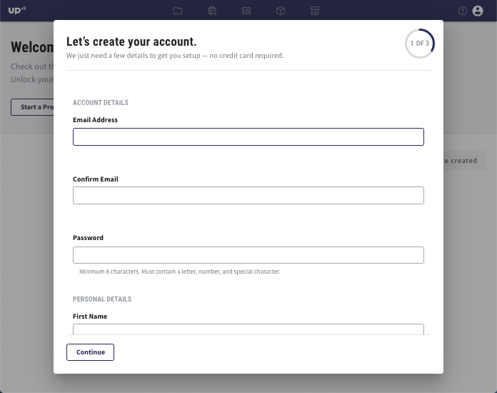
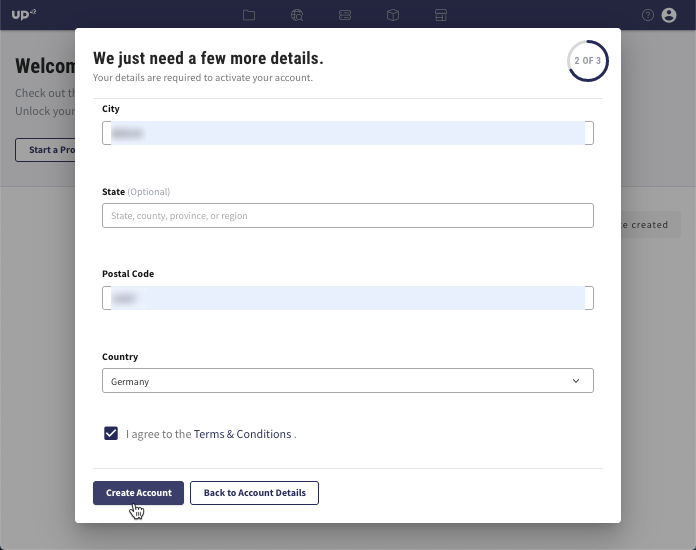
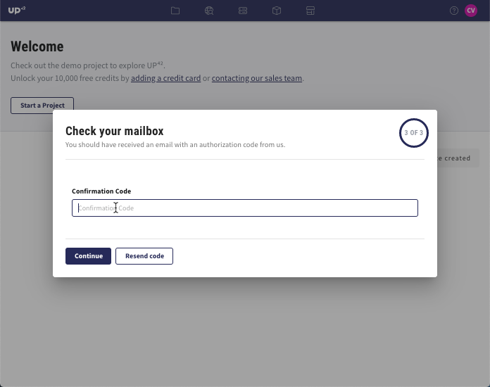

.. meta::
   :description: UP42 getting started: how to sign up
   :keywords: workflow how to, tutorial

.. _sign-up:

Create an UP42 account
======================

To get started with using the UP42 Console, new users get 10 000 UP42 credits (the equivalent of 100 Euro/Dollars) that can be used with:

* **free data**
* **free and commercial algorithms**

This way, you can leverage the insights that our powerful processing algorithms give you in combination with the free data available on UP42.

.. tip:: The 10 000 sign-up credits cannot be used for accessing commercial data. If you have a specific use case
         that you want to test using commercial data, please contact the `sales team <sales@up42.com>`_.

In order to access the `UP42 console <https://console.up42.com/>`_, you first need to sign up. A confirmation code will be sent to your email address. If this code does not appear in the Inbox or Spam email folder, then click on *Resend code*.

