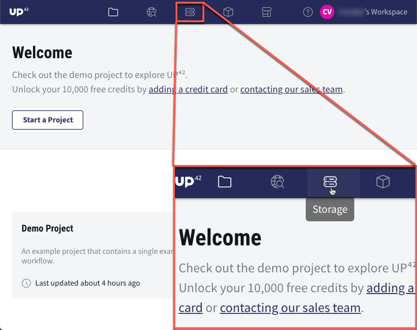
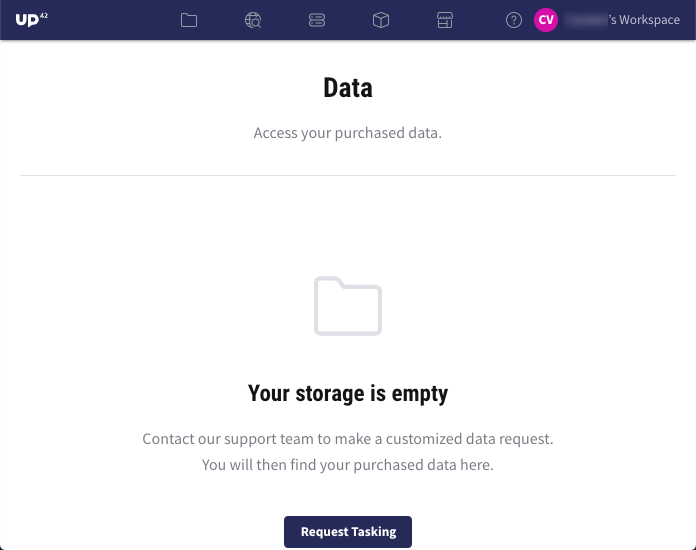
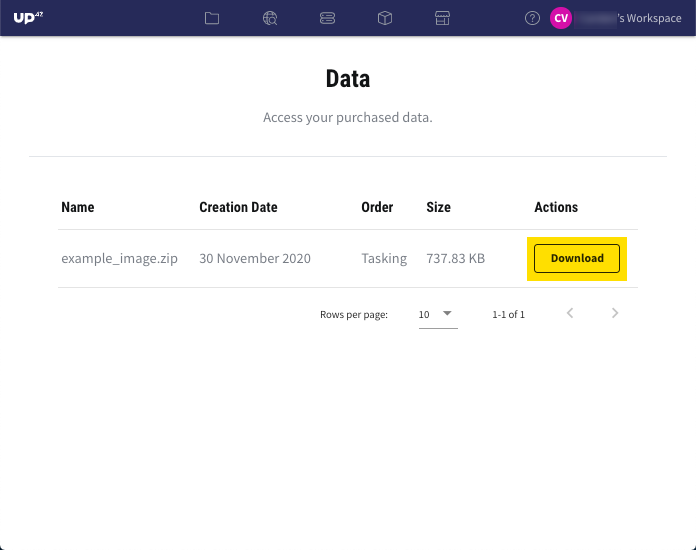

.. meta::
   :description: UP42 getting started: storage
   :keywords: console, tutorial, storage

====================
Storage
====================

This article assumes that you already signed up. To sign up, please visit the article `Create an UP42 account <https://docs.up42.com/getting-started/sign-up.html>`_.

Description
----------------

The UP42 Storage enables users to receive and store satellite tasking or archive image orders. These datasets are currently delivered by the UP42 team after a satellite tasking or archive order has been fulfilled.

.. note:: Only geospatial data in ZIP archive format can be delivered in the UP42 Storage.

How to open the UP42 Storage
------------------------------------------

To access the UP42 Storage, follow these steps:

1. In the blue menu bar, click on the *Storage* icon.

   
2. You will be redirected to the *Storage* window, which will display an empty *Data* dashboard.

  
3. Once you received geospatial data, the *Data* dashboard will be populated with the ZIP files that you can further download.
 

   
Congratulations! You can now take advantage of the delivery process via the UP42 Storage.