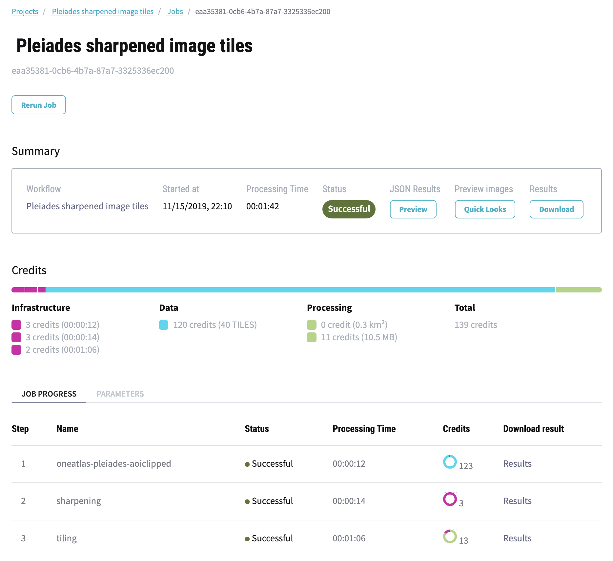

.. meta::
   :description: UP42 going further: platform core concepts
   :keywords: core concepts, blocks, workflows, tasks, projects  

.. _core-concepts:
              
====================================
 Core concepts: Block, Workflow, Job
====================================

Throughout the documentation, we use three core concepts: **blocks**,
**workflows** and **jobs**.  This section gives a comprehensive
explanation of these concepts and the role they play in the platform.
You can also find these and other terms in the :ref:`Glossary <glossary>`.

.. _blocks-definition:

Blocks
======

Blocks are the base units of the platform. There are two categories of blocks, **Data** and **Processing** blocks.

.. figure:: _assets/data_and_processing_block.png
    :align: center
    :scale: 35 %     
    :alt: Data and processing block diagram

**Data blocks** deliver satellite imagery, vector, IOT or any other type of geospatial data that can be used on UP42.
An example of a data block is the ``Sentinel-2 Level-1C Full-Scene`` block or the
``Plejades Streaming`` block.
Each data block on UP42 provides an :ref:`ouput capability <block-capabilities>`, specifying the output data type and
which follow-up processing blocks could be attached to the data block.

**Processing blocks** transform and/or analyze data, e.g. the ``Raster sharpening`` block
or the ``NDVI vegetation index`` block.
Each processing block provides an :ref:`input and an ouput capability <block-capabilities>`, specifying the input & output data types, and which
data or processing blocks can precede or follow on the selected processing block.

.. _workflows-definition:

Workflows
=========

A **workflow** is a `Directed Acyclic Graph
<https://en.wikipedia.org/wiki/Directed_acyclic_graph>`__ (DAG ) of data and processing blocks [#]_.
It describes which data sources will be used, how the data will be processed and how these steps are connected.
One block can be used in multiple workflows.

.. figure:: _assets/workflow.png
    :align: center
    :scale: 35 %
    :alt: Workflow block diagram

    Example workflow with one data block and two cascaded processing blocks.

When constructing the workflow in the UP42 console, the connections between
blocks are evaluated using their :ref:`input and ouput capabilites <block-capabilities>`.
Only blocks with congruent capabilities can be attached to each other.

.. _jobs-definition:

Jobs
====

A job is an instance of a workflow, run for a specified area of interest and parameter configuration.
The job page in the UP42 console shows the current **status** of the job, the **used parameters**, the **runtime**, **job id** and other metadata.
After the job is finished, the **job results can be downloaded** from this menu.

    UP42 job overview

Each workflow block or step that was run in the job can be called **task**. For each job task, the **intermediate result can be downloaded** in
the task details page. Here we can also find the **log messages** of each task (Used for e.g. error investigation and support).

Job parameters
--------------

In order to start a job, the user needs to specify the **job parameters**, consisting of:

* Data block :ref:`filters <filters>` (e.g. area of interest, time period etc.)
* Optional processing block **configuration** parameters (e.g. sharpening strength, filter size etc.)

.. _job-statuses:

Job statuses
------------

Before, during, and after running a job it can be in multiple states.

  + Before running the job:
      + ``not started``: the job/task hasn't started yet.
      + ``pending``: the job/task hasn't started yet but is pending to start.
    
  + While running:
      + ``running``: the job/task is running.
      + ``cancelling``: a request for cancelling the job has been issued, but the job is not **yet** cancelled.

  + After a job/task completed:
      + ``succeeded``: the job/task has finished successfully.
      + ``failed``: the job/task has failed.
      + ``cancelled``: the job/task as been cancelled.

Costs & time
------------

Additionally you also get information on:

 + Execution time.
 + Total cost of the job: data, processing and infrastructure costs,
   with the breakdown per task.  

.. rubric:: Footnotes

.. [#] Currently the workflow is a `linked list
       <https://en.wikipedia.org/wiki/Linked_list>`__
       of blocks. With a data
       block always at the root. Full DAG based workflows will be
       implemented in the future.
