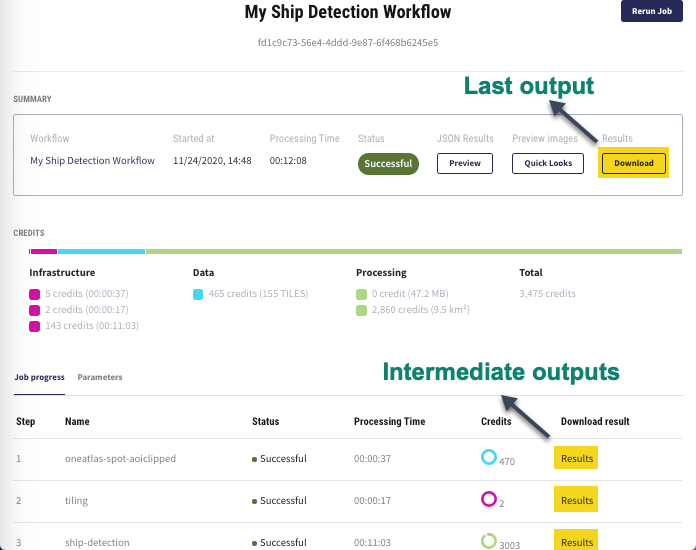

.. meta::
   :description: UP42 going further: platform core concepts
   :keywords: core concepts, block, workflow, task, project 

.. _core-concepts:
              
====================================
 Core concepts: Block, Workflow, Job
====================================

UP42 is based on three core concepts: **Block**, **Workflow** and **Job**. This section gives a comprehensive explanation of these concepts and the role they play in the UP42 platform.

.. tip:: For a more complete list of terms used in UP42, please visit the :ref:`Glossary <glossary>`.

.. _blocks-definition:

Block
=====

A block is defined as a unit that builds up a workflow. There are two types of blocks: **data blocks** and **processing blocks**. 
    
Data block
---------------

Data blocks deliver geospatial data (satellite or aerial images, vector data etc.) that can be directly downloaded, streamed or further analyzed with processing blocks. A data block is always followed by one or more processing blocks. 
Examples: 

- `Sentinel-2 L2A MSI Full Scenes <https://docs.up42.com/up42-blocks/data/aws-s2-l2a.html>`__
- `Pléiades Display (Streaming) <https://docs.up42.com/up42-blocks/data/pleiades-display-streaming.html>`__
- `Pléiades Reflectance (Download) <https://docs.up42.com/up42-blocks/data/pleiades-reflectance-download.html>`__

Processing block
-----------------------

Processing blocks apply algorithms that process data and deliver the corresponding outputs. A processing block can follow a data block or a processing block. 
Examples: 

- `Pan-sharpening SPOT/Pléiades <https://docs.up42.com/up42-blocks/processing/pansharpen.html>`__
- `Sentinel-2 Super-resolution <https://docs.up42.com/up42-blocks/processing/s2-superresolution.html>`__
- `UP42 Count Objects <https://docs.up42.com/up42-blocks/processing/up42-countobjects.html>`__
    
The blocks connect with each other if their input and output capabilities match. For example, a block that outputs a GeoTIFF is compatible with the next block that accepts GeoTIFF as input.

As the first block in the workflow, the data block has only an output capability. The processing block always follows a data block, so it has both an input and an output capability.

.. tip:: For more information, please visit the article `Block capabilities <https://docs.up42.com/reference/capabilities.html>`__.

.. _workflows-definition:

Workflow
=======

A workflow is a Directed Acyclic Graph (DAG ) of data and processing blocks [#]_. A workflow encompasses the data sources to be used, the algorithms to process the data and the order of the blocks. A workflow always starts with a data block and continues with one or more processing blocks. One block can be used in multiple workflows.

Building a workflow requires that the capabilities of the data and processing blocks match.

.. figure:: _assets/data_and_processing_block.png
    :align: center
    :scale: 90 %     
    :alt: Workflow with blocks
    
    Workflow built with one data and two processing blocks

.. _jobs-definition:

Job
===

A job generates the results defined by a workflow, according to the AOI and job parameters. 

.. note:: More jobs can be run for the same workflow.

Job parameters
---------------------

The job parameters define how data retrieval and/or data analysis should be performed. The job parameters include variables specific to each data and/or processing block. The variables have to be adjusted by the user according to their preferences. 

.. tip:: In order to correctly adjust the variables from the job parameters, it is recommended to read the block descriptions from the article `Blocks provided by UP42 <https://docs.up42.com/up42-blocks/index.html>`__ and the `UP42 marketplace <https://marketplace.up42.com/>`__. 

.. list-table:: 
   :widths: 50 50
   :header-rows: 1

   * - Blocks
     - Examples of job parameters
   * - Data Blocks
     - ``ids``
   * - Data Blocks
     - ``time``
   * - Data Blocks
     - ``limit``
   * - Data Blocks
     - ``zoom_level``
   * - Data Blocks
     - ``intersects/contains/bbox``
   * - Data Blocks
     - ``max_cloud_cover``
   * - Data Blocks
     - ``order_ids``
   * - Processing Blocks
     - ``clip_to_aoi``
   * - Processing Blocks
     - ``tile_width``
   * - Processing Blocks
     - ``tile_height``

.. note:: For more information, please consult the :ref:`filters <filters>`.

.. warning::  The AOI size and job parameters influence the job runtime and overall costs.

.. _job-statuses:

Job dashboard
--------------------

When running a job, a job dashboard appears, which contains information about the job progress (see table below).

.. list-table:: 
   :widths: 25 75
   :header-rows: 1

   * - JOB PROGRESS
     - Definition
   * - ``Step``
     - Steps set the order in which the job generates the results from each block. Features:
        - Each step is a task.
        - A job consists of one or more tasks.
        - Clicking on each task allows the users to view the log messages. 
   * - ``Name``
     - Data and processing blocks. Each name corresponds to a step or task.
   * - ``Status``
     - The progress of the job/task run:
        - ``Not started``: job/task did not start 
        - ``Pending``: job/task is about to start 
        - ``Running``:  job/task is running 
        - ``Cancelling``: job/task is getting cancelled by the user 
        - ``Failed``: job/task failed to run successfully 
        - ``Cancelled``: job/task was cancelled by the user 
        - ``Successful``: job/task finished successfully
   * - ``Processing Time``
     - The duration for each block and the overall duration. 
   * - ``Credits``
     - The credits consumed for each block and the total consumption. Credit consumption includes:
        - data costs
        - processing costs
        - infrastructure costs
   * - ``Download result``
     - The outputs can be downloaded in two ways:
        1. To download the output from the last block, click on *Download*.
        2. To download each individual output from each block, click on *Results*.

This is how the job dashboard is shown after running a job in the `UP42 Console <https://console.up42.com/>`__:

   
.. rubric:: Footnotes

.. [#] Currently, the workflow is a `linked list
       <https://en.wikipedia.org/wiki/Linked_list>`__
       of blocks and it always starts with a data
       block. Full DAG-based workflows will be
       implemented in the future.
