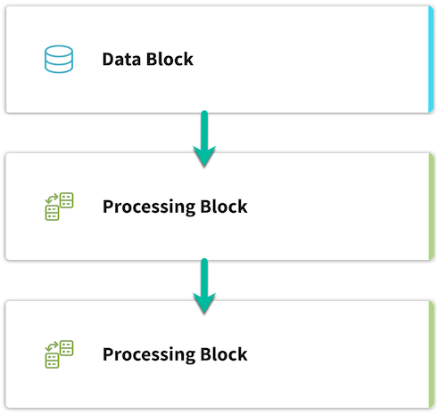

.. meta::
   :description: UP42 going further: platform core concepts
   :keywords: core concepts, blocks, workflows, tasks, projects  

.. _core-concepts:
              
===============
 Core concepts
===============

Throughout the documentation, we use three core concepts: **blocks**,
**workflows** and **jobs**.  This section gives a comprehensive
explanation of these concepts and the role they play in the platform.
You can also find these and other terms in the :ref:`Glossary <glossary>`.

.. _blocks-definition:

Blocks
======

Blocks are the base units of the platform. There are two categories of blocks, **Data** and **Processing** blocks.

**Data blocks** deliver satellite imagery, vector, IOT or any other type of geospatial data that can be used on UP42.
An example of a data block is the :ref:`Sentinel-2 Level-1C Full-Scene block <sentinel2-l1c-fullscene-block>` or the
:ref:`Plejades Streaming block <pleiades-aoiclipped-block>`.
Each data block on UP42 provides an :ref:`ouput capability <block-capabilities>`, specifying the output data type and
which follow-up processing blocks could be attached to the data block.

**Processing blocks** transform and/or analyze data, e.g. the :ref:`Raster sharpening filter block <sharpening-block>`
or the :ref:`NDVI vegetation block <ndvi-block>`.
Each processing block provides an :ref:`input and an ouput capability <block-capabilities>`, specifying the input & output data types, and which
data or processing blocks can precede or follow on the selected processing block.

.. _workflows-definition:

Workflows
=========

A **workflow** is a `Directed Acyclic Graph
<https://en.wikipedia.org/wiki/Directed_acyclic_graph>`__ (DAG )of blocks [#]_. It describes:

* What data sources will be used: data blocks.
* How the fetched data will be processed: processing blocks.
* How the blocks are connected.

A workflow is responsible for validating the connections between
blocks when creating a :ref:`job <jobs-definition>`.
Blocks can be shared among workflows.

.. figure:: _assets/workflow.png
    :align: center
    :scale: 35 %
    :alt: Workflow block diagram

    Example workflow with one data block and two cascaded processing blocks.
          
.. _jobs-definition:

Jobs
====

A **job** is an instance of a workflow. Jobs are created when running a workflow.

In order to start a job, :ref:`the following data must be provided <block-params>`:

* A **query** to determine how data should be :ref:`filtered <filters>` -- in
  the case of data blocks.
* Optional runtime **configuration** parameters -- in the case of processing blocks.

In the context of a job, a block is also called a **task**: each
step in the workflow is a task.

.. _before-start-job-statuses:

Before starting job statuses
----------------------------

Before starting a job/task can be in one of the following states:

  + ``not started``: the job/task hasn't started yet.
  + ``pending``: the job/task hasn't started yet but is pending to start.

.. _while-running-job-statuses:
    
While running job statuses
--------------------------

While a job/task is running it can be in one of the follwing states:

  + ``running``: the job (taks) is running.
  + ``cancelling``: a request for cancelling a job has been issued and
    that action is being taken, but the job is not **yet** cancelled.  

.. _after-running-job-statuses:
    
After running job statuses
--------------------------

After a job/task completes it can in one of the following states:

  + ``succeeded``: the job/task has finished successfully.
  + ``failed``: the job/task has failed.
  + ``cancelled``: the job/task as been cancelled.

Logs
----

While each job/task is running a **log** is written and made available to
you.

Results
-------

After each job/task completes the results are made available for the
complete job -- the complete workflow final result -- or each task --
step in the workflow.

Costs & time
------------

Additionally you also get information on:

 + Execution time.
 + Total cost of the job: data, processing and infrastructure costs,
   with the breakdown per task.  

.. rubric:: Footnotes

.. [#] Currently the workflow is a `linked list
       <https://en.wikipedia.org/wiki/Linked_list>`__
       of blocks. With a data
       block always at the root. Full DAG based workflows will be
       implemented in the future.
