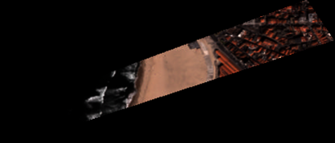

.. meta::
   :description: UP42 going further: Download blocks tutorial
   :keywords: spot, pleiades, data block, very-high resolution, download, multi-spectral

.. _download-blocks-tutorial-spot-pleiades:

==========================================
Spot and Pléiades download blocks tutorial
==========================================

Introduction
------------

You have currently two options to acquire very-high resolution (SPOT
6/7 and Pléiades) satellite imagery in UP42:

 \1. Streaming
   Based on a specified :term:`AOI` **stream** the tiles related to that
   AOI as images and use them in your :term:`workflow` as you see
   fit. This provides the RGB bands, and optionally, also the
   panchromatic band. This data is to be used only once, i.e., each
   :term:`job` of a given workflow, for the **same** AOI, will **always**
   acquire the data. Which means that you are paying for it each time
   you rerun a job or run a job where the AOI is unchanged. This means
   that there is no way to re-use the acquired images in your workflow.

 \2. Downloading
   Based on a specified :term:`AOI` **download** the image related to
   that AOI in `DIMAP
   <https://www.intelligence-airbusds.com/en/8722-the-dimap-format>`__
   format. This data can be used **indefinitely**, i.e., you now own
   this image. Note that the returned image fits exactly to the
   specified AOI if you use a :ref:`contains <contains-filter>` for
   the data query in the :term:`job parameters`.

.. _download-block-pros:

What do download blocks offer?
------------------------------

As described above :ref:`SPOT 6/7 <spot-download-block>` and
:ref:`Pléiades <pleiades-download-block>` download blocks allow to
re-use images and also provide all the available bands in each
satellite. Which are, respectively:

.. table:: SPOT available bands
   :align: center

   =============  ================  ================
    band           wavelength [μm]   resolution [m]
   =============  ================  ================
   Panchromatic   0.450-0.745            1.5
   Blue           0.450-0.520            6
   Green          0.530-0.590            6
   Red            0.625-0.695            6
   Near Infrared  0.760-0.890            6
   =============  ================  ================

.. table:: Pléiades available bands
   :align: center

   =============  ================ ================
    band           wavelength [μm]  resolution [m]
   =============  ================ ================
   Panchromatic   0.470-0.830           0.5
   Blue           0.430-0.550            2
   Green          0.500-0.620            2
   Red            0.590-0.710            2
   Near Infrared  0.740-0.940            2
   =============  ================ ================

This allows you to use algorithms like :term:`NDVI` for vegetation
analysis and/or any other algorithm that relies on multi-spectral data
in your :term:`workflow`.

Additionally: download blocks are an :term:`analytical product`, i.e., the
images that they provide can be interpreted in terms of reflectance
or radiance. Thus enabling the extraction of quantitative information
about surface features. Consequently, they are not the most adequate for visual
display purposes (:term:`visual product`). For that you should use the
:ref:`Pléaides streaming <pleiades-aoiclipped-block>`
and/or :ref:`SPOT streaming <spot-aoiclipped-block>` blocks.

.. tip::

   You can create a :term:`visual product` from a download block image
   by multiplying each pixel value by 256/4096 --- 12 to 8 bit
   conversion --- or by invoking
   `gdal_translate <https://gdal.org/programs/gdal_translate.html>`_
   with the ``-scale`` option.

.. figure:: _assets/ndvi-spot-example.png
   :align: center
   :alt: NDVI map generated from SPOT imagery in Berlin

NDVI map generated from SPOT imagery in Berlin. Darker shade of green
suggests higher vegetation vitality.

Get a price estimate
--------------------

To get a price estimate you need to run a :ref:`Test query <test-query>`. In the
returned GeoJSON. When you select an AOI in the console by default the
job :ref:`runs <test-query-ui>` as a Test query.

Here is an example with the job parameters:

.. code:: javascript

   {
     "config": {
     "mode": "DRY_RUN"
     },
     "oneatlas-pleiades-fullscene:1": {
        "ids": null,
        "time": null,
        "limit": 1,
        "order_ids": null,
        "intersects": {
          "type": "Polygon",
          "coordinates": [
             [
               [
                 -8.710999,
                 41.187342
               ],
               [
                 -8.701859,
                 41.190701
               ],
               [
                 -8.701047,
                 41.189484
               ],
               [
                 -8.71018,
                 41.186517
               ],
               [
                 -8.710999,
                 41.187342
             ]
            ]
          ]
        },
        "time_series": null
      }
    }

This AOI as comprises an area of 0.11 sqkm.

.. warning::

   Both download blocks only accept an AOI with an **area greater
   than 0.1 sqkm** or 100000 sqm. Any AOI smaller than this results
   in the output returning no images.

Downloading the output we have the following GeoJSON:

.. gist:: https://gist.github.com/perusio/dd284a2c20800d776de6f5dceb0bc838

Looking at the raw data we have the *extra* fields:

.. code:: javascript

   {
     ...
        fileSize: 1449,
        estimatedCredits: 111
     ...
   }

``estimatedCredits`` is the price estimation, in this case 111
:ref:`credits <credit>`.

Alternatively you can look into the logs for the :term:`task` and
at the end see the estimated credits.

.. code:: bash

   ...
   2019-09-16 14:00:10,725 - pleiades - INFO - ==================================================================
   2019-09-16 14:00:10,725 - pleiades - INFO - Estimated credits for this job: 111
   2019-09-16 14:00:10,725 - pleiades - INFO - ==================================================================

   2019-09-16 14:00:10,725 - pleiades - DEBUG - Saving 1 result features to data.json

Download the image
------------------

Now that you have the price estimate we can proceed and acquire the
image. To do this we rerun the job as a real job by clicking on the
**Run as real job** button on the console job details page. When the
job is launched, the upstream creates an order ID. This is the unique
identifier for the downloaded image.

.. gist:: https://gist.github.com/perusio/5aab70f4ab7e32a8cd649ed2b0f3cb2c

Looking at the raw output there is the field ``orderID``:

.. code:: javascript

   {
      ...
         "orderID": "002e11d3-3b46-43a5-a07d-855a94c72817",
         "fileSize": 1449
      ...
   }

This ID is **required** whenever you want to re-use the image. This
way you won have to pay for it again.

Alternatively you can look in the task log for the :term:`job` to get
the order ID. At the end of the log:

.. code:: bash

   2019-09-19 05:02:51,685 - pleiades - INFO - ==================================================================
   2019-09-19 05:02:51,685 - pleiades - INFO - ==================================================================
   2019-09-19 05:02:51,686 - pleiades - INFO - The following orders were created and processed and can be re-used
   2019-09-19 05:02:51,686 - pleiades - INFO - 002e11d3-3b46-43a5-a07d-855a94c72817
   2019-09-19 05:02:51,686 - pleiades - INFO - ==================================================================

   2019-09-19 05:02:51,686 - pleiades - DEBUG - Saving 1 result features to data.json

the order ID is ``002e11d3-3b46-43a5-a07d-855a94c72817``.

Re-use it in a workflow
-----------------------

As explained above the download blocks returns the acquired images in
DIMAP format. In order to use those images in any :term:`workflow` you
need to either use the The :ref:`DIMAP conversion
<dimap-conversion-block>` or the :ref:`Pansharpening for Pléaides/SPOT
<pansharpen-block>` block, so that a GeoTIFF is generated from the
downloaded DIMAP. Thus allowing you to use any :term:`processing
block` in this image.

We are going to build a workflow consisting of a :ref:`Pléiades
<pleiades-download-block>`, data block, the :ref:`DIMAP
conversion <dimap-conversion-block>` block, and finally the
:ref:`tiling <tiling-block>` block. This could then be followed by a
Ship or car detection block, for example.

.. warning::

   The currently available ship detection, car detection and similar
   processing blocks algorithms where trained using `pan-sharpened
   <https://en.wikipedia.org/wiki/Pansharpened_image>`__
   8 bit RGB images and not on the *raw* images --- no pan-sharpening
   --- presently returned by the :ref:`DIMAP
   <dimap-conversion-block>` block, or even the pansharpened images
   returned by the :ref:`Pansharpening for Pléiades/SPOT
   <pansharpen-block>` block. In a nutshell: those algorithms were
   developed and work for a :term:`visual product`, not an
   :term:`analytical product` like the ones returned by the Pléaides
   and SPOT download blocks.

Now you have the ``order ID`` generated when the image was downloaded
from the upstream data provider. Since you already payed for this
image you can re-use it indefinitely. To do this you **must** enter
the order ID as a parameter for your job. For this particular
workflow:

.. gist:: https://gist.github.com/up42-epicycles/be903d94b904d2011b044ce472065b17

You can see the field ``order_ids``:

.. code:: javascript

   ...
   "order_ids": [
      "002e11d3-3b46-43a5-a07d-855a94c72817"
     ],
   ...

which is an array of order IDs. In this case it has only one entry,
because we are using only one image we downloaded previously, but if
you want to use multiple previously downloaded images just add
all the order IDs in this array.

And the output shown here as a GeoTIFF.

The downloaded image show heer as a a PNG with a black background.

.. warning::

    Note that the original GeoTIFF image is comprised only of the
    portion corresponding to the given AOI. Also bear in mind that
    this AOI has the minimum allowed area: 0.11 sqkm.

.. tip::

    Find out more about the DIMAP image format `here
    <https://www.intelligence-airbusds.com/en/8722-the-download-format>`_. DIMAP
    is a GDAL supported `raster format
    <https://gdal.org/drivers/raster/dimap.html>`_.
