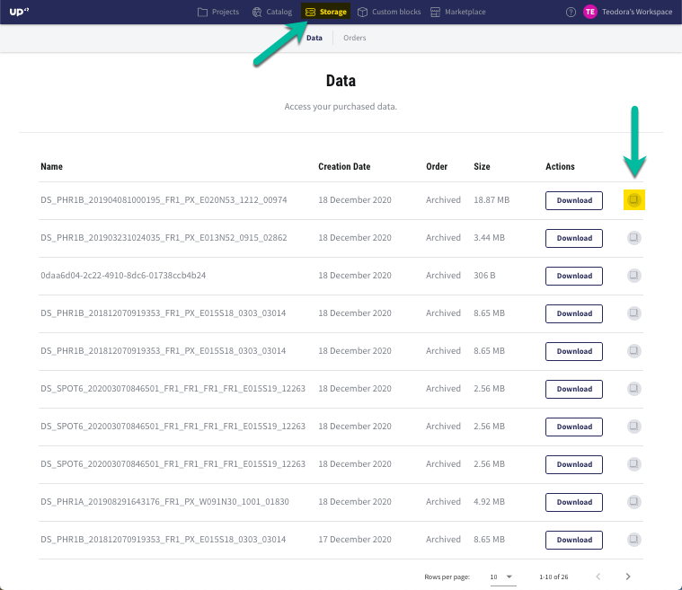
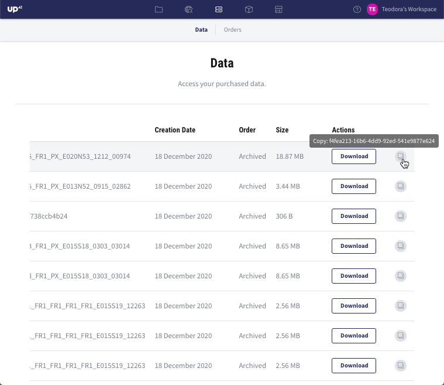
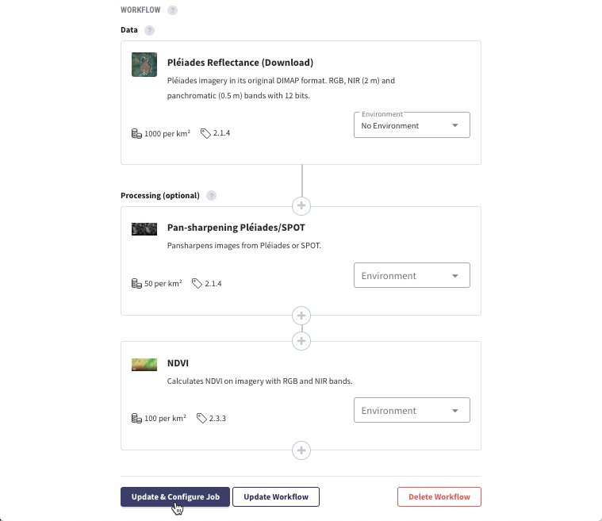
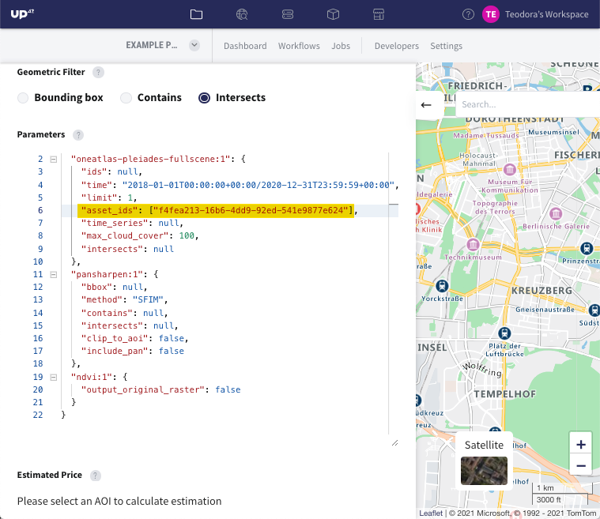
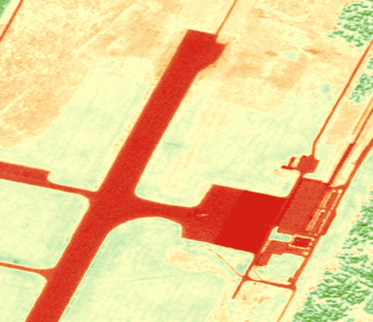

.. meta::
   :description: UP42 going further: Download and streaming blocks
   :keywords: spot, pleiades, data block, very-high resolution, download, multi-spectral

.. _download-blocks-tutorial-spot-pleiades:

===============================================
Pléiades and SPOT streaming and download blocks
===============================================

Introduction
----------------

This article presents the various types of Pléiades and SPOT images available on the UP42 platform. Very-high resolution Pléiades and SPOT images can be accessed in two ways:

 \1. Streaming
   **A streaming block** provides data that contains all web Mercator tiles intersecting or covering the specified AOI in a spatial resolution defined by the used zoom level. For more information, please refer to `Zoom levels <https://wiki.openstreetmap.org/wiki/Zoom_levels>`_.

   The available output bands for streamed images are: **red**, **green**, **blue**, and **panchromatic** (optional). NIR is not available.

   A streamed image can only be used once (i.e. each job of a given workflow over the same AOI will always re-acquire the streamed image). This means that users are paying for the streamed image each time they rerun a job.

   According to the End User License Agreement, the following policies apply for streamed images:

   * **Users are not allowed to download the streamed images or the outputs of processing blocks that provide the pixel values of the original streamed images.** Example of non-eligible processing blocks: `Raster Tiling <https://docs.up42.com/up42-blocks/processing/tiling.html>`_, `Raster CRS Conversion <https://docs.up42.com/up42-blocks/processing/crs-conversion.html>`_.

   * **Users are allowed to download only outputs that do not provide the pixel values of the original streamed images.** Example of eligible processing blocks: `Car Detection <https://marketplace.up42.com/block/7d8dda9f-db1e-4645-9c1b-e056e0bdc698>`_, `Ship Detection <https://marketplace.up42.com/block/79e3e48c-d65f-4528-a6d4-e8d20fecc93c>`_.

   .. list-table::
      :widths: 100
      :header-rows: 1

      * - Streaming data blocks
      * - `Pléiades Display (Streaming) <https://docs.up42.com/up42-blocks/data/pleiades-display-streaming.html>`_
      * - `SPOT 6/7 Display (Streaming) <https://docs.up42.com/up42-blocks/data/spot-display-streaming.html>`_

 \2. Download
   **A download block** provides data in its original DIMAP V2 format clipped to the provided AOI. Separate directories are included for multispectral and panchromatic data. You can open each by selecting the DIM*.xml file.

   The available output bands for downloaded images are: **red**, **green**, **blue**, **NIR** and **panchromatic**.

   A downloaded image can be used indefinitely and it is owned by the user who purchased the image. A downloaded image can be used multiple times. This means that users are not paying for the downloaded image each time they rerun a job with this image.

   .. list-table::
      :widths: 100
      :header-rows: 1

      * - Download data blocks
      * - `Pléiades Reflectance (Download) <https://docs.up42.com/up42-blocks/data/pleiades-reflectance-download.html>`_
      * - `Pléiades Display (Download) <https://docs.up42.com/up42-blocks/data/pleiades-display-download.html>`_
      * - `SPOT 6/7 Reflectance (Download) <https://docs.up42.com/up42-blocks/data/spot-reflectance-download.html>`_
      * - `SPOT 6/7 Display (Download) <https://docs.up42.com/up42-blocks/data/spot-display-download.html>`_

.. _download-block-pros:

What is the advantage of using download data blocks?
------------------------------------------------------------------------

The Pléiades and SPOT download blocks have the following advantages:

1. Users pay for the images only once.
2. Users own the images when purchasing them.
3. Users can re-use the images when running jobs for other workflows.
4. Users have access to all the available bands of the images.
5. Users can apply advanced algorithms such as vegetation analysis (e.g. NDVI).
6. Pléiades Reflectance (Download) and SPOT Reflectance (Download) are analytical products which have been radiometrically and geometrically corrected. The processing level is called *ortho* and it ensures that images are used for quantitative studies and time series analyses.

.. note:: For more information, please read the User Guides for `Pléiades <https://www.intelligence-airbusds.com/en/4555-pleiades-user-
             guide>`_ and `SPOT <https://www.intelligence-airbusds.com/automne/api/docs/v1.0/document/download/ZG9jdXRoZXF1ZS1kb2N1bWVudC01NTY0NQ==/ZG9jdXRoZXF1ZS1maWxlLTU1NjQ0/SPOT6-7_UserGuide_201906.pdf>`_.

.. tip:: In order to download images which are visually pleasing, we recommend using the data blocks **Pléiades
         Display (Download)** and **SPOT Display (Download)**. However, they are not analytical products.

Pléiades and SPOT Spectral Bands
------------------------------------------------

.. table:: Pléiades
   :align: center

   =============  ================  ================
    band           wavelength [μm]  resolution [m]
   =============  ================  ================
   Panchromatic   0.470-0.830           0.5
   Blue           0.430-0.550            2
   Green          0.500-0.620            2
   Red            0.590-0.710            2
   Near Infrared  0.740-0.940            2
   =============  ================  ================

.. table:: SPOT
   :align: center

   =============  ================  ================
    band           wavelength [μm]   resolution [m]
   =============  ================  ================
   Panchromatic   0.450-0.745            1.5
   Blue           0.450-0.520            6
   Green          0.530-0.590            6
   Red            0.625-0.695            6
   Near Infrared  0.760-0.890            6
   =============  ================  ================

How to re-use the downloaded image
--------------------------------------------------

This section assumes that you created a workflow that contains one of the download data blocks and successfully ran a job after following steps 1 to 16 from the article `Build the first UP42 workflow <https://docs.up42.com/getting-started/first-workflow.html>`_.

In this example, the workflow consisted of the following blocks:

* `Pléiades Reflectance (Download) <https://docs.up42.com/up42-blocks/data/pleiades-reflectance-download.html>`_
* `Pan-sharpening Pléiades/SPOT <https://docs.up42.com/up42-blocks/processing/pansharpen.html>`_
* `NDVI <https://docs.up42.com/up42-blocks/processing/ndvi.html>`_

When running a job for the first time, the image downloaded from the upstream data provider gets a unique asset ID. To re-use this image in multiple workflows or during multiple job runs of the same workflow, follow the steps below:

1. Open the `UP42 Console <https://console.up42.com/>`_ and go to *Storage*.

2. The dashboard will be populated with Pléiades (PHR) or SPOT images that were previously downloaded during job runs. Select an image and copy the asset ID from the right side. In this example, we used Pléiades images.

3. Go to the previously created workflow and click *Update & Configure Job*.

4. Go to the job configuration window and paste the asset ID as an array in the placeholder ``asset_ids``.

The job parameters are shown below:

.. gist:: https://gist.github.com/up42-epicycles/be903d94b904d2011b044ce472065b17

5. Run the job. After downloading the outputs, the NDVI map can be displayed with the free software QGIS:

.. tip:: DIMAP is a raster format supported by GDAL. For more information about DIMAP, please refer to the article `The
         DIMAP Format <https://www.intelligence-airbusds.com/en/8722-the-dimap-format>`_.
