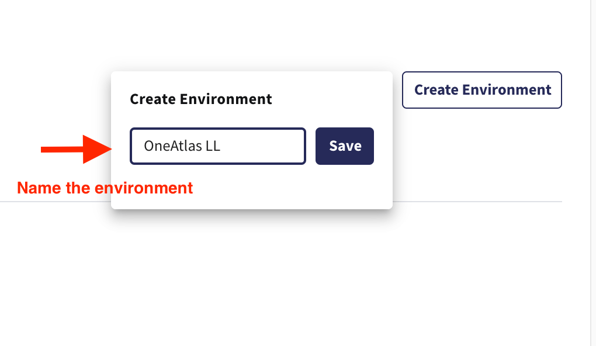
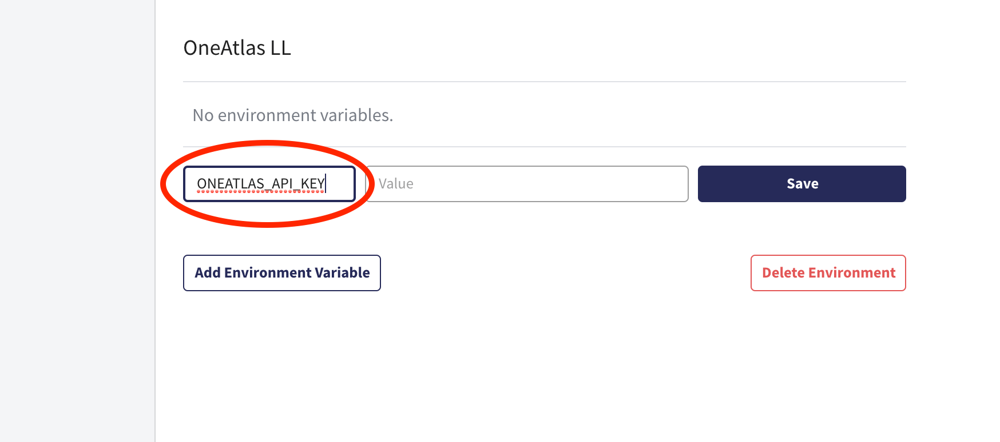
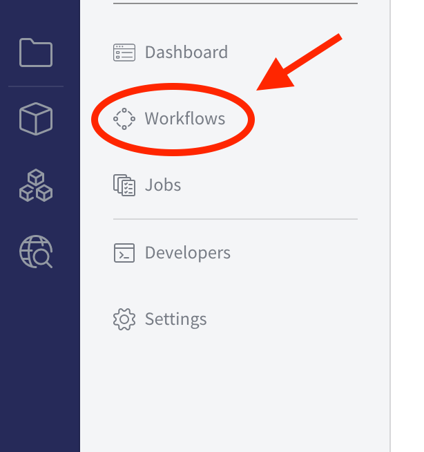
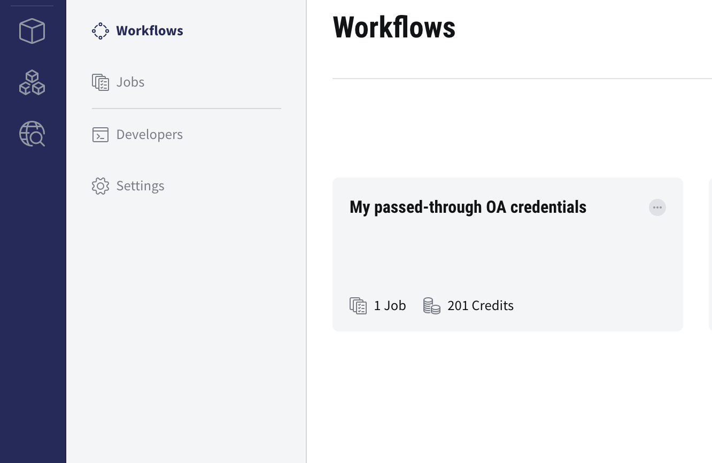
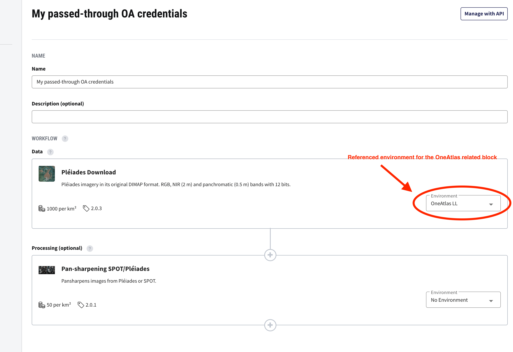
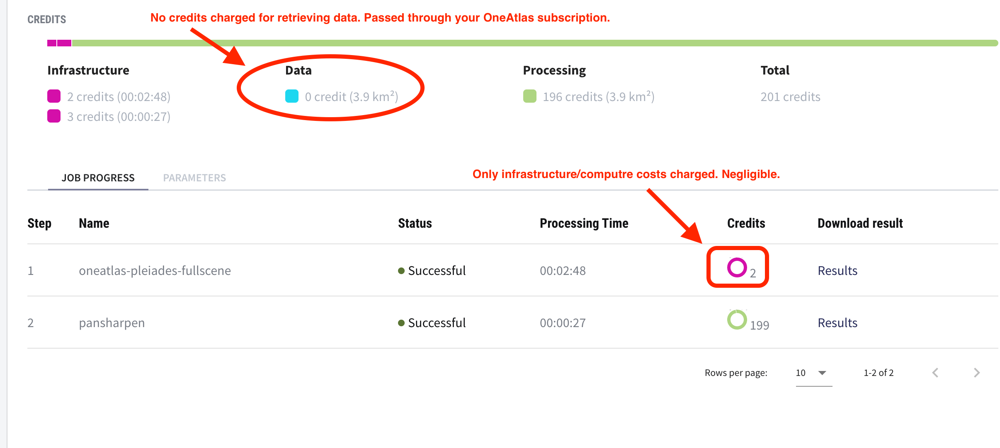

.. meta::
   :description: UP42 going further: Environments and credentials
                 pass-through tutorial
   :keywords: environments, variables, credentials pass-through, oneatlas, aws s3
   :robots: noindex

.. _environments-credentials-pass-through-tutorial:

==================================================
Environments and credentials pass-through tutorial
==================================================

Introduction
------------

Environments are a secure mechanism for you to specify `environment
variables <https://en.wikipedia.org/wiki/Environment_variable>`_ that
are specific to any :term:`workflow` you create.

This enables you to use external services and/or set specific values
that are used repeatedly in a given workflow. Consider the following
examples:

 \1. Using external storage systems
    If you are exchanging data  with a storage system external
    to UP42, like `AWS S3 <https://aws.amazon.com/s3/>`_ or `Google
    Cloud Storage <https://cloud.google.com/storage/>`_, or even your
    own dedicated storage system. In that case you will need to have a
    secure mechanism to pass the credentials to those
    services as environment variables that a given block will make use
    of to push and/or pull data from.

 \2. Using 3rd party data services
     If you have a subscription to a 3rd
     party data service, e.g., `Airbus OneAtlas Living Library
     <https://oneatlas.airbus.com/>`_, you can take advantage of the
     UP42 platform flexibility, in what workflow orchestration and
     computational resources is concerned, while using your own
     OneAtlas subscription. This applies to any other data provider
     that is present on the `UP42 Marketplace
     <https://marketplace.up42.com>`_. You need a secure mechanism to
     pass these service credentials, so that you can retrieve data from
     the 3rd party service without incurring any data acquisition
     costs on UP42. You only pay for the compute resources, which
     usually amounts to a few credits. Hence completely negligible, in
     the context of high-value commercial data like the one provided
     by Airbus in this example.

 \3. Using 3rd party processing services If you have a extremely
     computationally intensive task that runs on your dedicated
     hardware, or even in an external public or private cloud
     infrastructure, then you would want to get the data through the
     UP42 marketplace, use our workflow orchestration capabilities and
     offload the intensive computation into your `HPC
     <https://en.wikipedia.org/wiki/Supercomputer>`_ cluster, for
     example. To access that resource you need a secure mechanism to
     specify the access credentials for that compute resource.

Using environments can be approached from two diverse perspectives:

 - For using 3rd party data and/or processing services with currently
   available `UP42 Marketplace <https://marketplace.up42.com>`_ blocks.

 - For your own :term:`custom block`.

This tutorial deals with the first only: using enviroments with 3rd
party services from the UP42 Marketplace.

.. note::

   If you are building a custom block and want to make use of
   environments, then please email `<mailto:support@up42.com>`_ ,as currently
   this is undocumented.

.. _oa-credentials-pass-through:

An example of retrieving data from a 3rd party data service: Airbus OneAtlas
----------------------------------------------------------------------------

As stated above, if you have a OneAtlas subscription that you want to
rely upon, while leveraging the workflow orchestration and data and/or
processing functionalities of UP42, that can be set up quite
easily. In what UP42 is concerned, once you have your `OneAtlas Living
Library <https://oneatlas.airbus.com/living-library/learn-more>`_ API
key, it takes just three simple steps to set up your credentials
pass-through.

 1. Create an environment.
 2. Add the API key as a variable to this environment.
 3. Reference this environment in the relevant blocks in your workflow(s).
 4. Done.

If you already have a OneAtlas Living Library API key we recommend you
created a new one just for using it on UP42. This way you can manage
it separately from your other API key(s).

Step number 0 is generating a new API key. For completeness sake we
document it here. Bear in mind that since this is an external service
we cannot guarantee the accuracy of the information herein
provided. There can be changes that we are not aware that render the
instructions for generating the OneAtlas API key outdated. We aim for
it to be as accurate as possible, but we cannot claim any strict
adherence to the evolution of an external service interface.

Let us start.

.. _oa-apikey:

Step 0: Create a OneAtlas API key
+++++++++++++++++++++++++++++++++

 1. Login to your `OneAtlas account <https://oneatlas.airbus.com/>`_.
 2. Go to your API key listing page at: `<https://account.foundation.oneatlas.airbus.com/>`_.
 3. Create a new API key and copy the value.
 4. Done.

.. warning::

   The API key is only displayed once. If you fail to copy the value,
   it will be lost and you will need to generate a new API key if fail
   to save it somewhere. Use only temporary storage for this purpose,
   either your own secret store or any other secure storage system.

.. _create-environment:

Step 1: Create an environment
+++++++++++++++++++++++++++++

 1. Login into the `UP42 console <https://console.up42.com>`_.
 2. Go to the account settings at: `<https://console.up42.com/settings/account>`_.
 3. Click on the `Workspace <https://console.up42.com/settings/workspace>`_ button.
 4. Select the **Environments** tab that will take you to:
    `<https://console.up42.com/settings/workspace#environments>`_.
 5. Click on the button towards the lower left corner of the window:
    **Create Environment**. Name your environment meaningfully.
 6. You now should have an empty environment.
 7. Done.

Here is a screenshot illustrating environment creation.

Now we can proceed to add the OneAtlas API key as an environment variable.

.. _add-environemnt-oa-apikey:

Step 2: Add the API key as an environment variable
++++++++++++++++++++++++++++++++++++++++++++++++++

 1. Add a variable to environment named ``ONEATLAS_API_KEY``.
 2. Copy the OneAtlas API key into the **value** field and save the
    environment variable.
 3. Now you should see your newly created environment variable
    ``ONEATLAS_API_KEY`` with the masked value of your OneAtlas API key.
 4. Done.

A set of screenshots illustrating environment variable creation.

.. figure:: _assets/environments-tutorial-add-variable-opt.png
   :align: center
   :alt: Add an environment variable

   Add an environment variable.

   Add the OneAtlas API key environment variable.

.. figure:: _assets/environments-tutorial-save-variable-opt.png
   :align: center
   :alt: Save the variable

   Save the variable.

.. note::

   In this case we added a **single** environment variable. But we can
   add as many as we want. As long as we name the variables differently.
   In this particular case the OneAtlas related data blocks expect an
   environment variable named ``ONEATLAS_API_KEY``. Otherwise the
   credentials pass-through will fail.

.. warning::

   Environments are **append only**, i.e., you can add as many
   variables as you want, but you cannot change their values. If you
   need to change the value of a variable you need to create a **new**
   environment and add the variable with the respective changed value
   there.

.. _reference-environment-variable-workflow:

Step 3: Reference the environment in a workflow
+++++++++++++++++++++++++++++++++++++++++++++++

 1. Go the workflow page of the project where you want to enable the
    OneAtlas credentials pass-through.
 2. Select the desired workflow.
 3. Reference the environment in the relevant workflow block(s).
 4. Done.

Here is the illustrated sequence of steps to reference the environment
in a workflow.

   Go to the workflows for your project.

   Select a workflow where you want to enable the OneAtlas credentials pass-through.

   Reference the environment in the relevant block(s) of the workflow.

If you instantiate the workflow, by running a job, in the end your
credit usage report makes evident that no credits where charged for
the blocks using passed-through credentials.

   No credits consumed for data retrieval from OneAtlas. Your
   credentials were passed-through.

Step 4: Done
++++++++++++

You should have by now have succesfully ran jobs without getting
charged on UP42 for the retrieved Airbus satellite data through your
OneAtlas subscription.
