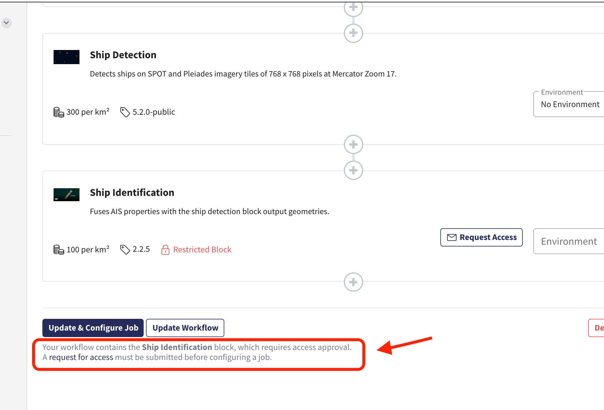
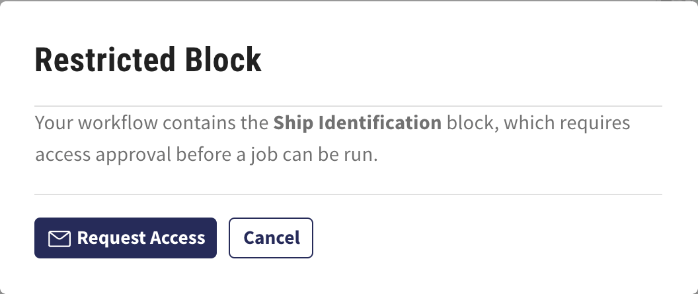

.. meta::
   :description: UP42 going further: easy access to restricted blocks
   :keywords: data block, processing block, access, restricted data,
              restricted algorithms

.. _restricted-blocks-tutorial:

=============================================
How to easily get access to restricted blocks
=============================================

Introduction
------------

Most data available on UP42 is free to access for every customer that
is :ref:`compliant <compliance-faq>` with ourr `terms & conditions
<https://up42.com/legal/terms-and-conditions/>`_. However, there is
data and/or processing blocks that **might** have additional
restrictions.

 \1. Data access restrictions.
     Due to the **sensitivity** of the data.  Some data provides very
     detailed information about a certain aspect of the world, e.g., a
     very detailed elevation model that can potentially be used for
     nefarious purposes.

 \2. Commercial use restrictions.
     The data provider might impose restrictions on the use of the
     data being provided. For example, they might have a previous
     commercial agreement with some type of entity and they want to
     make sure that said entity doesn't get access to the data
     circumventing the previous commercial agreement.

For those reasons some blocks are restricted. Nevertheless we
encourage you to use those blocks because they provide either unique
data sets or unique processing algorithms that are otherwise difficult
to come by.

.. _easy-access-restricted-blocks:

How to easily access restricted blocks
--------------------------------------

For illustration purposes we are going to use the `Ship Identification
block
<https://marketplace.up42.com/block/54217695-73f4-4528-a575-a429e9af6568>`_
that relies on `AIS
<https://en.wikipedia.org/wiki/Automatic_identification_system>`_ data
to identify ships detected by the `Ship detection block
<https://marketplace.up42.com/block/79e3e48c-d65f-4528-a6d4-e8d20fecc93c>`_. If
you want to know more about these blocks you can consult the
documentation for the ship identification block  :ref:`here <ship-identification>`.

The process has **three** steps:

 1. Add the restricted block to your workflow.
 2. Request access by sending email to the block access request
    support address.
 3. Get notified about the access status once a decision on the access
    is reached.
 4. Done.

Step 1: Add the block to your workflow
++++++++++++++++++++++++++++++++++++++

In this case you need a workflow that has the `Ship detection block
<https://marketplace.up42.com/block/79e3e48c-d65f-4528-a6d4-e8d20fecc93c>`_
and after you add the `Ship Identification
block
<https://marketplace.up42.com/block/54217695-73f4-4528-a575-a429e9af6568>`_.

As you can see there is a warning message below about the ship
identification block. You can add it to the workflow but you won't be
able to use it until granted access. In the next step you will request
access to the block.

Step 2: Requesting access
+++++++++++++++++++++++++

Once you select the save the workflow and go to configuring the job a
popup appears.

If you select the **Request Access** button then it **delegates** to
the mail application that you have configured in your operating system
environment and populates the message with the following questions
that you neeed to reply to:

 + In what industry are you doing business?
 + Describe your potential use case for this block.
 + What sort of licensing might you require?
   (I.e., will the results be used internally or externally?)

You **should** provide answers to these questions in the original
request email. Failing to do so adds additional messaging between our
support team and you.

.. tip::

   If you have no configured mail application in your system the above
   described automatic email message generation will fail. However, You can
   send an email **directly** to
   `support.block-access@up42.com
   <mailto:support.block-access@up42.com>`_ where you quote the
   questions and provide the answers.

   + In what industry are you doing business?
   + Describe your potential use case for this block.
   + What sort of licensing might you require?
     (I.e., will the results be used internally or externally?)

Step 3: Getting communicated the access decision
++++++++++++++++++++++++++++++++++++++++++++++++

The decision process for each restricted block will **always** involve
the partner providing the data or algorithm. It is not something UP42
does on its own. Since we have **contractual obligations** towards the
partner that must be observed on a **case by case basis** when granting
access. We work together with you and the partner to reach a decision
on granting access to the block as quickly as possible.

Step 4: Done
++++++++++++

Once you have access to the block you can use it to your desire in
your workflows.
