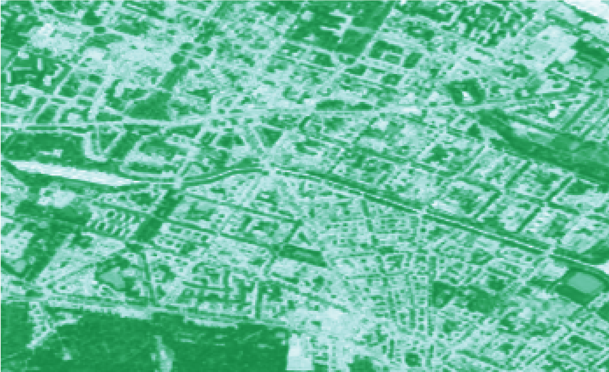

.. meta::
   :description: UP42 going further: Using DIMAP download blocks
   :keywords: spot, pleiades, data block, development, processing, dimap

.. _using-download-block:

=============================================
Using DIMAP download blocks
=============================================

In order to make use of all the available bands present in certain datasets
(such as SPOT and Pleiades) you will have to make use of the DIMAP download blocks.

Making use of the additional multispectral bands (other than red, green and blue) allows you
to do detailed vegetation analysis (calculating :term:`NDVI` for instance) or any workflow that
relies on the full multispectral instruments' capabilities.

  NDVI map generated from SPOT imagery in Berlin. Darker green suggest higher vegetation vitality.

First we will give you an introduction on the DIMAP download blocks, and secondly we will discuss the
converter block that allows you to continue your workflow with this datasets with regular processing blocks.

The DIMAP download block
------------------------

Currently two DIMAP download blocks are available: the :ref:`Pleaides DIMAP download <pleiades-dimap-block>` and the
:ref:`SPOT DIMAP download <spot-dimap-block>`.

.. tip::

	Find out more about the DIMAP image format `here <https://www.intelligence-airbusds.com/en/8722-the-dimap-format>`_. DIMAP is a GDAL supported `raster format <https://gdal.org/drivers/raster/dimap.html>`_.

Both of these blocks return a DIMAP file and the :term:`AOI` within the output feature geometry.

This block allows you to forecast how many credits will be used in the workflow you have setup.
An estimation of the number of credits is reported in the Task Logs once you run a Test Query.

.. warning::

	The DIMAP download blocks only accepts AOI with an **area greater than 0.1 sqkm** or 1000 sqm. Any AOI smaller than this will return an empty result.

One of the main differences between the DIMAP block vs. the AOI-Clipped block is the fact that with the DIMAP block you obtain a **permanent license that you can use in perpetuity for the image** you have purchased.
Once you have run the DIMAP download block, you will have an ``order_id`` that you can reuse in other Workflows in order to reuse the same imagery.

The ``order_id`` is an hash string (such as ``9e5122b5-a24c-43b3-82fd-40430449039b``) and you can use it directly in the ``order_id`` filter in the corresponding data block. You can find this ``order_id`` in the
logs of the Task (such as ``oneatlas-spot-fullscene`` or ``oneatlas-pleiades-fullscene``).

The Data Format and Type Conversion block
-----------------------------------------

The :ref:`Data Format and Type Conversion <data-format-type-conversion-block>` allows you to generate a ``GTiff`` product out of a DIMAP download block.

If you make use of the default parameters only the multispectral bands of the product will be used and included in the ``GTiff`` output of the block.
If you want to obtain the pansharpened product **only** you can set the ``ms`` parameter to ``false`` and the ``pan`` parameter to ``true``.

For example, to convert a :ref:`SPOT DIMAP download <spot-dimap-block>` to a panchromatic ``GTiff`` use:

.. code-block:: javascript

    {
      "oneatlas-spot-fullscene:1": {
        "bbox": [
          13.405215963721279,
          52.48480326228838,
          13.4388092905283,
          52.505278605259086
        ],
        "ids": null,
        "time": null,
        "limit": 1,
        "order_ids": null,
        "time_series": null
      },
      "converter:1": {
        "ms": false,
        "pan": true
      }
    }

Try it out
----------

Let's spin up this block! First create a project described in :ref:`Building your first workflow <build-first-workflow>`.

In the Project page you just created create a Workflow and add a :ref:`SPOT DIMAP Download <spot-dimap-block>` as the data block.

Also add the :ref:`Data Format and Type Conversion <data-format-type-conversion-block>` as a processing block. **Click next.**

Run the job as a **Test Query** with the following parameters:

.. code-block:: javascript

    {
      "oneatlas-spot-fullscene:1": {
        "bbox": [
          13.405215963721279,
          52.48480326228838,
          13.4388092905283,
          52.505278605259086
        ],
        "ids": null,
        "time": null,
        "limit": 1,
        "order_ids": null,
        "time_series": null
      },
      "converter:1": {
        "ms": true,
        "pan": false
      }
    }

Once the :term:`job` is ``Successful``, click on the name of the :term:`task`
(``oneatlas-spot-fullscene``) and scroll down on the logs. You should see this output:

.. code-block:: bash

  2019-09-10 11:42:50,340 - blockutils.common - DEBUG - Raw task parameters from
        UP42_TASK_PARAMETERS are: {"bbox": [13.405215963721279,52.48480326228838,
        13.4388092905283,52.505278605259086],"ids":null,"time":null,"limit":1,
        "order_ids":null,"time_series":null}

  ...

  2019-09-10 11:42:53,309 - spot - INFO - ======================================
  2019-09-10 11:42:53,309 - spot - INFO - Estimated credits for this job: 3802
  2019-09-10 11:42:53,309 - spot - INFO - ======================================

  2019-09-10 11:42:53,309 - spot - DEBUG - Saving 1 result features

Using the Test Query allows you to understand what images you will be using and
it will give you an estimation of the number of credits that will be charged, before running the Real Job.

.. warning::

	In addition to the Data credits used by the :ref:`SPOT DIMAP Download <spot-dimap-block>`, credits will also be deducted for Infrastructure and Processing so the total amount of credits for the Workflow will always be higher than the estimation provided in the Logs displayed before.

If you're happy about the selected image, click **Run as real job**.

After the Real Job is ``Successful``, go to the Job page, and click on the first Task (``oneatlas-spot-fullscene``) and go to Logs.
Scroll down an you should see both the number of tiles returned and your ``order_id``:

.. code-block:: bash

  2019-09-10 11:50:59,219 - blockutils.common - DEBUG - Raw task parameters from
    UP42_TASK_PARAMETERS are: {"ids":null,"bbox":[13.405215963721279,52.48480326228838,
    13.4388092905283,52.505278605259086],"time":null,"limit":1,"order_ids":null,
    "time_series":null}

  ...

  2019-09-10 11:53:25,956 - spot - INFO - ==================================================================
  2019-09-10 11:53:25,956 - spot - INFO - The following orders were created and processed and can be re-used
  2019-09-10 11:53:25,956 - spot - INFO - 9e5122b5-a24c-43b3-82fd-40430449039b
  2019-09-10 11:53:25,956 - spot - INFO - ==================================================================

  2019-09-10 11:53:25,956 - spot - DEBUG - Saving 1 result features

If you then click on the Results of this workflow you will be able to download a ``GTiff`` product resulting from the DIMAP converter.

This GeoTiff product can then be used with all the regular processing blocks included in our platform.
